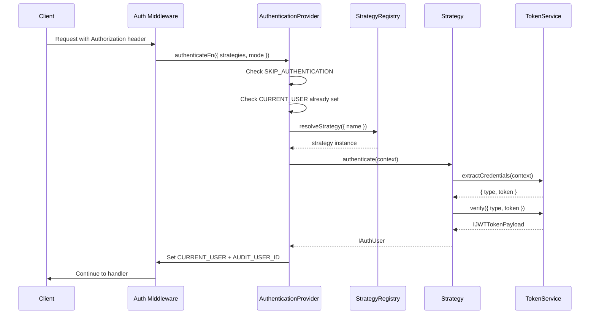
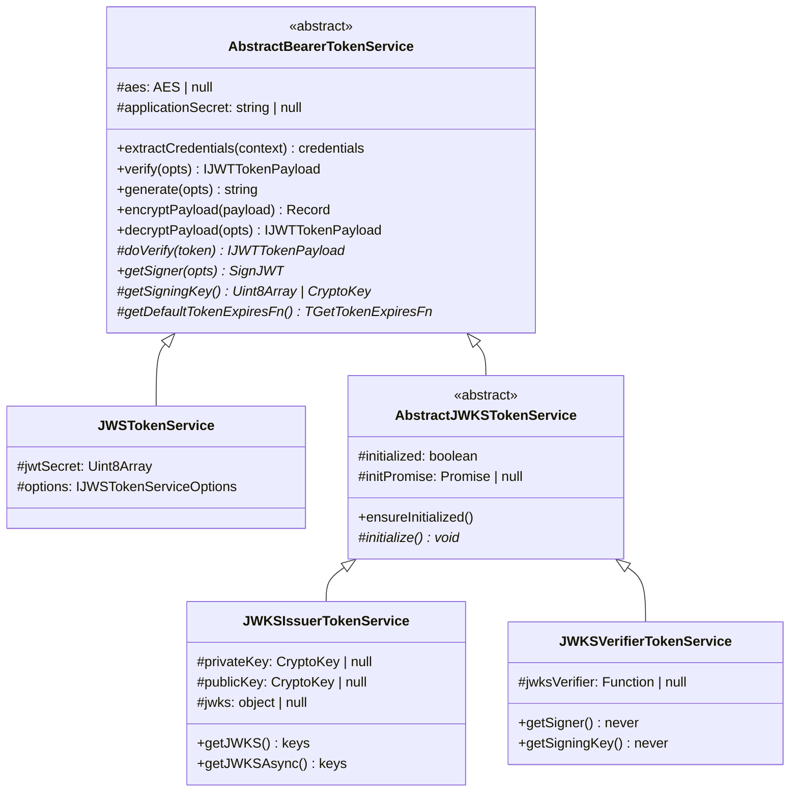

# Authentication -- API Reference

> Architecture, service hierarchy, strategy registry, JWKS controller, and controller factory. See [Setup & Configuration](./) for initial setup.

## Architecture

```
  ┌──────────────────────────────────────────────────────────────────┐
  │                         Application                              │
  │                                                                  │
  │  preConfigure()                                                  │
  │    ├── bind JWT_OPTIONS (TJWTTokenServiceOptions)                │
  │    │     └── standard: JWS | JWKS                                │
  │    ├── bind BASIC_OPTIONS / REST_OPTIONS                         │
  │    ├── this.component(AuthenticateComponent)                     │
  │    └── AuthenticationStrategyRegistry.register() ← manual        │
  └────────────────────────────┬─────────────────────────────────────┘
                               │
                               ▼
  ┌──────────────────────────────────────────────────────────────────┐
  │                AuthenticateComponent.binding()                    │
  │                                                                  │
  │  1. Read JWT_OPTIONS, BASIC_OPTIONS, REST_OPTIONS                │
  │  2. Switch on jwtOptions.standard:                               │
  │     ├── JWS  → defineJWSAuth()  → JWSTokenService                │
  │     └── JWKS → defineJWKSAuth() → switch on mode:                │
  │                 ├── issuer   → JWKSIssuerTokenService             │
  │                 │              + JWKSController (/certs)          │
  │                 └── verifier → JWKSVerifierTokenService           │
  │  3. defineBasicAuth() → BasicTokenService                        │
  │  4. defineControllers() → AuthController (factory-built)         │
  │  5. defineOAuth2() → stub (not yet implemented)                  │
  └────────────────────────────┬─────────────────────────────────────┘
                               │
         ┌─────────────────────┼──────────────────────┐
         ▼                     ▼                      ▼
  ┌──────────────┐   ┌────────────────┐    ┌──────────────────┐
  │ Bearer Token │   │  BasicToken    │    │  AuthController   │
  │ Services     │   │  Service       │    │  (factory-built)  │
  │ (see below)  │   └───────┬────────┘    └────────┬─────────┘
  └──────┬───────┘           │                      │
         │                   ▼                      ▼
         │            ┌──────────────┐    ┌──────────────────┐
         │            │ Basic        │    │ /sign-in          │
         │            │ Strategy     │    │ /sign-up          │
         │            └──────────────┘    │ /change-password  │
         │                                │ /who-am-i         │
         ▼                                └──────────────────┘
  ┌──────────────────────────────────────────────────────────┐
  │           Bearer Token Service Hierarchy                  │
  │                                                          │
  │  AbstractBearerTokenService (base)                       │
  │    ├── extractCredentials()                              │
  │    ├── verify() → doVerify()                             │
  │    ├── generate() → getSigner() + getSigningKey()        │
  │    ├── encryptPayload() / decryptPayload() (optional)    │
  │    │                                                     │
  │    ├── JWSTokenService (symmetric HS256)                 │
  │    │     ├── JWSAuthenticationStrategy                   │
  │    │     └── sign with shared secret                     │
  │    │                                                     │
  │    └── AbstractJWKSTokenService (lazy-init + retry)      │
  │          ├── ensureInitialized() / initialize()          │
  │          │                                               │
  │          ├── JWKSIssuerTokenService (asymmetric)         │
  │          │     ├── JWKSIssuerAuthenticationStrategy      │
  │          │     ├── sign with private key                 │
  │          │     ├── verify with public key                │
  │          │     └── getJWKS() / getJWKSAsync()            │
  │          │                                               │
  │          └── JWKSVerifierTokenService (remote verify)    │
  │                ├── JWKSVerifierAuthenticationStrategy    │
  │                └── verify via createRemoteJWKSet()       │
  └──────────────────────────────────────────────────────────┘
```

### Tech Stack

| Technology | Purpose |
|------------|---------|
| **`jose`** | JWT signing (`SignJWT`), verification (`jwtVerify`), JWKS (`createRemoteJWKSet`, `exportJWK`, `importPKCS8`, `importSPKI`, `importJWK`), and type definitions |
| **`@venizia/ignis-helpers`** | `AES` utility for payload encryption, `BaseHelper`/`BaseService` base classes, `getError` for error creation, `HTTP` result codes |
| **Hono middleware** | Route-level authentication integration via `createMiddleware` from `hono/factory` |
| **`node:fs/promises`** | Async file reading for JWKS key files |
| **Drizzle ORM** | Database access for user lookup (in your implementation) |

## Component Methods

The `AuthenticateComponent` uses five methods during its `binding()` lifecycle (four private, one public):

| Method | Purpose |
|--------|---------|
| `defineJWSAuth(opts)` | Validates JWS secrets (rejects falsy values and `'unknown_secret'`), validates `getTokenExpiresFn`, binds `IJWSTokenServiceOptions` to `JWT_OPTIONS`, registers `JWSTokenService`. |
| `defineJWKSAuth(opts)` | Switches on `mode`: **Issuer** — validates keys, format, kid, getTokenExpiresFn; binds to `JWKS_OPTIONS`; registers `JWKSIssuerTokenService` + `JWKSController`. **Verifier** — validates jwksUrl; binds to `JWKS_OPTIONS`; registers `JWKSVerifierTokenService`. |
| `defineBasicAuth(opts)` | Validates `verifyCredentials` callback presence, binds `BasicTokenService` as a service. Logs debug if skipped. |
| `defineControllers(opts)` | Requires `jwtOptions` when `useAuthController: true`. Calls `defineAuthController()` factory and registers the generated controller. |
| `defineOAuth2()` | **Public** stub method -- not yet implemented. Called during `binding()` but performs no action. |

> [!NOTE]
> The component reads `TJWTTokenServiceOptions` (the discriminated union) from `AuthenticateBindingKeys.JWT_OPTIONS`, then re-binds just the inner options (`IJWSTokenServiceOptions` or `IJWKSIssuerOptions`/`IJWKSVerifierOptions`) to the appropriate binding key for the service to consume via `@inject`.

## Strategy Registry

`AuthenticationStrategyRegistry` is a **singleton** that manages all registered strategies. It extends `AbstractAuthRegistry<IAuthenticationStrategy>` (not generic on `Env`).

### API

| Method | Signature | Returns | Description |
|--------|-----------|---------|-------------|
| `getInstance()` | `static` | `AuthenticationStrategyRegistry` | Returns the singleton instance (creates if not exists) |
| `register` | <code v-pre>(opts: { container: Container; strategies: Array&lt;{ name: string; strategy: TClass&lt;IAuthenticationStrategy&gt; }&gt; }) =&gt; this</code> | `this` | Registers strategies as singletons in the container. Returns `this` for chaining. |
| `resolveStrategy` | `(opts: { name: string }) => IAuthenticationStrategy` | `IAuthenticationStrategy` | Resolves a strategy instance from the container by name |

**Registration:**
```typescript
AuthenticationStrategyRegistry.getInstance().register({
  container: this,
  strategies: [
    { name: Authentication.STRATEGY_JWT, strategy: JWKSIssuerAuthenticationStrategy },
    { name: Authentication.STRATEGY_BASIC, strategy: BasicAuthenticationStrategy },
  ],
});
```

> [!NOTE]
> `register()` returns `this`, enabling method chaining if needed.

**How it works:**
- Strategies are stored in an internal map and bound to the DI container as singletons
- Binding keys follow the pattern `authentication.strategy.{name}` (e.g., `authentication.strategy.jwt`, `authentication.strategy.basic`)
- The standalone `authenticate()` function creates middleware via `AuthenticationProvider`, which uses the registry to resolve strategies

**Middleware creation:**

The `authenticate()` function returns a Hono middleware that:
1. Checks if `Authentication.SKIP_AUTHENTICATION` is set on context — if true, skips entirely (logs debug)
2. Checks if `Authentication.CURRENT_USER` is already set on context — if true, skips (already authenticated)
3. Reads `strategies` and `mode` from the provided options
4. Executes strategies based on mode (`any` or `all`)
5. On success, sets `Authentication.CURRENT_USER` and `Authentication.AUDIT_USER_ID` on context
6. On failure, throws 401 with list of tried strategies



### Standalone `authenticate()` Function

```typescript
const authenticationProvider = new AuthenticationProvider();
const authenticateFn = authenticationProvider.value();

export const authenticate = (opts: { strategies: string[]; mode?: TAuthMode }) => {
  return authenticateFn(opts);
};
```

This is the primary export for creating auth middleware. It creates an `AuthenticationProvider` instance and calls `.value()` to get the middleware factory. The provider uses `AuthenticationStrategyRegistry.getInstance()` internally to resolve strategies.

> [!NOTE]
> In `all` mode, if every strategy passes but the final user payload has no `userId`, the middleware throws a `401` with message `"Failed to identify authenticated user!"`. The `any` mode **discards errors** from each failing strategy (logs at debug level) and only throws after all strategies are exhausted.

## Service Class Hierarchy



## AbstractBearerTokenService

Base class for all Bearer token services. Extends `BaseService`. Generic on <code v-pre>&lt;E extends Env = Env&gt;</code>.

**File:** `packages/core/src/components/auth/authenticate/services/bearer/abstract.service.ts`

### Static Fields

| Field | Type | Description |
|-------|------|-------------|
| `JWT_COMMON_FIELDS` | <code v-pre>Set&lt;'iss' \| 'sub' \| 'aud' \| 'jti' \| 'nbf' \| 'exp' \| 'iat'&gt;</code> | Standard JWT fields that are never encrypted |

### Protected Fields

| Field | Type | Default | Description |
|-------|------|---------|-------------|
| `aes` | `AES \| null` | `null` | AES utility instance, configured by `configurePayloadEncryption()` |
| `applicationSecret` | `string \| null` | `null` | AES secret, configured by `configurePayloadEncryption()` |

### Methods

| Method | Signature | Description |
|--------|-----------|-------------|
| `configurePayloadEncryption` | `(opts: { aesAlgorithm?: AESAlgorithmType; applicationSecret?: string }) => void` | Configures optional AES encryption. Both `aes` and `applicationSecret` must be set for encryption to activate. |
| `extractCredentials` | <code v-pre>(context: TContext&lt;E, string&gt;) =&gt; { type: string; token: string }</code> | Extracts Bearer token from Authorization header |
| `verify` | <code v-pre>(opts: { type: string; token: string }) =&gt; Promise&lt;IJWTTokenPayload&gt;</code> | Template method — calls `doVerify()` |
| `generate` | <code v-pre>(opts: { payload: IJWTTokenPayload; getTokenExpiresFn?: TGetTokenExpiresFn }) =&gt; Promise&lt;string&gt;</code> | Template method — calls `getSigner()` + `getSigningKey()` |
| `encryptPayload` | <code v-pre>(payload: IJWTTokenPayload) =&gt; Record&lt;string, any&gt;</code> | AES-encrypts non-standard JWT fields. Returns payload unchanged if AES not configured. |
| `decryptPayload` | <code v-pre>(opts: { result: JWTVerifyResult&lt;IJWTTokenPayload&gt; }) =&gt; IJWTTokenPayload</code> | Decrypts AES-encrypted fields. Returns payload unchanged if AES not configured. |

### Abstract Methods (implemented by subclasses)

| Method | Visibility | Signature | Description |
|--------|------------|-----------|-------------|
| `doVerify` | `protected` | `(token: string) => Promise<IJWTTokenPayload>` | Verify the raw JWT token and return the payload |
| `getSigner` | **`public`** | <code v-pre>(opts: { payload: IJWTTokenPayload; getTokenExpiresFn: TGetTokenExpiresFn }) =&gt; Promise&lt;SignJWT&gt;</code> | Create a `jose.SignJWT` instance with the payload |
| `getSigningKey` | `protected` | `() => ValueOrPromise<Uint8Array \| CryptoKey>` | Return the signing key |
| `getDefaultTokenExpiresFn` | `protected` | `() => TGetTokenExpiresFn` | Return the default token expiry function |

## JWSTokenService

Symmetric JWT (HS256) token service with optional AES-encrypted payloads. Extends `AbstractBearerTokenService`.

**File:** `packages/core/src/components/auth/authenticate/services/bearer/jws.service.ts`

### JWSAuthenticationStrategy

Extends `BaseHelper` and implements <code v-pre>IAuthenticationStrategy&lt;E&gt;</code>.

```typescript
class JWSAuthenticationStrategy<E extends Env = Env>
  extends BaseHelper
  implements IAuthenticationStrategy<E>
{
  name = Authentication.STRATEGY_JWT;
  standard = JOSEStandards.JWS;

  constructor(
    @inject({
      key: BindingKeys.build({
        namespace: BindingNamespaces.SERVICE,
        key: JWSTokenService.name,
      }),
    })
    private service: JWSTokenService<E>,
  ) { ... }

  authenticate(context: TContext<E, string>): Promise<IAuthUser> {
    const token = this.service.extractCredentials(context);
    return this.service.verify(token);
  }
}
```

### Protected Fields

| Field | Type | Description |
|-------|------|-------------|
| `jwtSecret` | `Uint8Array` | Encoded JWT secret for `jose` signing/verification |
| `options` | `IJWSTokenServiceOptions` | Injected options |

### Constructor Behavior

The constructor validates required options and throws immediately (status 500) if any are missing:

```typescript
constructor(
  @inject({ key: AuthenticateBindingKeys.JWT_OPTIONS })
  protected options: IJWSTokenServiceOptions,
) {
  // Throws '[JWSTokenService] Invalid jwtSecret' if !jwtSecret
  // Throws '[JWSTokenService] Invalid getTokenExpiresFn' if !getTokenExpiresFn
  // Calls configurePayloadEncryption({ aesAlgorithm, applicationSecret })
  // Encodes jwtSecret to Uint8Array for jose
}
```

> [!NOTE]
> `applicationSecret` is no longer validated in the constructor. If not provided, AES encryption is simply not configured, and payloads pass through in plaintext.

### Overridden Methods

| Method | Behavior |
|--------|----------|
| `doVerify(token)` | Calls `jwtVerify(token, this.jwtSecret)`, then `this.decryptPayload()` |
| `getSigner(opts)` | Calls `this.encryptPayload()`, then creates `SignJWT` with HS256 header |
| `getSigningKey()` | Returns `this.jwtSecret` |
| `getDefaultTokenExpiresFn()` | Returns `this.options.getTokenExpiresFn` |

## AbstractJWKSTokenService

Base class for JWKS token services (Issuer + Verifier). Extends `AbstractBearerTokenService`.

**File:** `packages/core/src/components/auth/authenticate/services/bearer/jwks/abstract.service.ts`

Consolidates the lazy-initialization pattern with retry-on-failure semantics. If `initialize()` rejects, `initPromise` is reset so the next call retries instead of caching the failure permanently.

### Protected Fields

| Field | Type | Default | Description |
|-------|------|---------|-------------|
| `initialized` | `boolean` | `false` | Whether the service has been initialized |
| `initPromise` | `Promise<void> \| null` | `null` | Pending initialization promise (for concurrent callers) |

### Methods

| Method | Signature | Description |
|--------|-----------|-------------|
| `ensureInitialized` | `() => Promise<void>` | Lazily initializes the service on first call. Concurrent callers share the same promise. On failure, resets `initPromise` so the next call retries. |

### Abstract Methods

| Method | Signature | Description |
|--------|-----------|-------------|
| `initialize` | `() => Promise<void>` | Perform one-time async initialization (load keys, create verifier, etc.) |

## JWKSIssuerTokenService

Asymmetric JWT token service (issuer mode). Extends `AbstractJWKSTokenService`.

**File:** `packages/core/src/components/auth/authenticate/services/bearer/jwks/issuer.service.ts`

### JWKSIssuerAuthenticationStrategy

```typescript
class JWKSIssuerAuthenticationStrategy<E extends Env = Env>
  extends BaseHelper
  implements IAuthenticationStrategy<E>
{
  name = Authentication.STRATEGY_JWT;
  standard = JOSEStandards.JWKS;

  constructor(
    @inject({
      key: BindingKeys.build({
        namespace: BindingNamespaces.SERVICE,
        key: JWKSIssuerTokenService.name,
      }),
    })
    private service: JWKSIssuerTokenService<E>,
  ) { ... }

  authenticate(context: TContext<E, string>): Promise<IAuthUser> {
    const token = this.service.extractCredentials(context);
    return this.service.verify(token);
  }
}
```

### Protected Fields

| Field | Type | Default | Description |
|-------|------|---------|-------------|
| `privateKey` | `CryptoKey \| Uint8Array \| null` | `null` | Private key for signing (loaded during `initialize`) |
| `publicKey` | `CryptoKey \| Uint8Array \| null` | `null` | Public key for verification (loaded during `initialize`) |
| `jwks` | `{ keys: JWK[] } \| null` | `null` | Cached JWKS for the `/certs` endpoint |

### Constructor Behavior

```typescript
constructor(
  @inject({ key: AuthenticateBindingKeys.JWKS_OPTIONS })
  protected options: IJWKSIssuerOptions,
) {
  // Calls configurePayloadEncryption({ aesAlgorithm, applicationSecret })
  // Keys are NOT loaded here — loaded lazily via ensureInitialized()
}
```

### Initialization Flow

The `initialize()` method:
1. **Resolves key content** — reads from file (`readFile` from `node:fs/promises`) or uses inline text, based on `keys.driver`
2. **Parses key material** — imports keys using `importPKCS8`/`importSPKI` (PEM format) or `importJWK` (JWK format), based on `keys.format`
3. **Exports public JWK** — calls `exportJWK()` and adds `kid`, `alg`, `use: 'sig'` metadata
4. **Caches JWKS** — stores `{ keys: [publicJWK] }` for the `/certs` endpoint
5. **Sets `initialized = true`**

### Overridden Methods

| Method | Behavior |
|--------|----------|
| `doVerify(token)` | Calls `ensureInitialized()`, then `jwtVerify(token, this.publicKey!)`, then `this.decryptPayload()` |
| `getSigner(opts)` | Calls `ensureInitialized()`, then `this.encryptPayload()`, then creates `SignJWT` with algorithm + kid header |
| `getSigningKey()` | Returns `this.privateKey` |
| `getDefaultTokenExpiresFn()` | Returns `this.options.getTokenExpiresFn` |

### JWKS Methods

| Method | Signature | Description |
|--------|-----------|-------------|
| `getJWKS` | `() => { keys: JWK[] }` | Synchronous — returns cached JWKS. Throws if not yet initialized. |
| `getJWKSAsync` | `() => Promise<{ keys: JWK[] }>` | Async — calls `ensureInitialized()` first, then returns JWKS. |

### Internal Methods

| Method | Signature | Description |
|--------|-----------|-------------|
| `resolveKeyContent` | `(opts: { keys }) => Promise<{ priv: string; pub: string }>` | Reads key content from file or returns inline text |
| `parseKeyMaterial` | `(opts: { raw, algorithm, keys }) => Promise<{ priv, pub }>` | Imports keys using `jose` based on format (PEM or JWK) |

## JWKSVerifierTokenService

Asymmetric JWT token service (verifier mode). Extends `AbstractJWKSTokenService`.

**File:** `packages/core/src/components/auth/authenticate/services/bearer/jwks/verifier.service.ts`

### JWKSVerifierAuthenticationStrategy

```typescript
class JWKSVerifierAuthenticationStrategy<E extends Env = Env>
  extends BaseHelper
  implements IAuthenticationStrategy<E>
{
  name = Authentication.STRATEGY_JWT;
  standard = JOSEStandards.JWKS;

  constructor(
    @inject({
      key: BindingKeys.build({
        namespace: BindingNamespaces.SERVICE,
        key: JWKSVerifierTokenService.name,
      }),
    })
    private service: JWKSVerifierTokenService<E>,
  ) { ... }

  authenticate(context: TContext<E, string>): Promise<IAuthUser> {
    const token = this.service.extractCredentials(context);
    return this.service.verify(token);
  }
}
```

### Protected Fields

| Field | Type | Default | Description |
|-------|------|---------|-------------|
| `jwksVerifier` | `ReturnType<typeof createRemoteJWKSet> \| null` | `null` | Remote JWKS verifier function |

### Constructor Behavior

```typescript
constructor(
  @inject({ key: AuthenticateBindingKeys.JWKS_OPTIONS })
  protected options: IJWKSVerifierOptions,
) {
  // Calls configurePayloadEncryption({ aesAlgorithm, applicationSecret })
  // Remote JWKS is NOT fetched here — fetched lazily via ensureInitialized()
}
```

### Initialization Flow

The `initialize()` method:
1. Creates a `createRemoteJWKSet()` from the configured `jwksUrl`
2. Configures `cacheMaxAge` (default 12h) and `cooldownDuration` (default 30s)
3. Sets `initialized = true`

### Overridden Methods

| Method | Behavior |
|--------|----------|
| `doVerify(token)` | Calls `ensureInitialized()`, then `jwtVerify(token, this.jwksVerifier!)`, then `this.decryptPayload()` |
| `getSigner(opts)` | Throws — verifier mode cannot sign tokens |
| `getSigningKey()` | Throws — verifier mode cannot sign tokens |
| `getDefaultTokenExpiresFn()` | Throws — verifier mode has no token expiry |

## JWKSController

Serves the JWKS endpoint (default path `/certs`). This endpoint is **intentionally unauthenticated** — it serves the public keys needed by external verifiers.

**File:** `packages/core/src/components/auth/authenticate/controllers/jwks/controller.ts`

```typescript
class JWKSController extends BaseController {
  constructor(
    @inject({
      key: BindingKeys.build({
        namespace: BindingNamespaces.SERVICE,
        key: JWKSIssuerTokenService.name,
      }),
    })
    private jwksService: JWKSIssuerTokenService,
  ) {
    super({ scope: JWKSController.name, path: '/certs', isStrict: true });
  }

  override binding(): ValueOrPromise<void> {
    this.defineRoute({
      configs: RouteConfigs.GET_JWKS_CERTS,
      handler: async context => {
        const jwks = await this.jwksService.getJWKSAsync();
        context.header('Cache-Control', 'public, max-age=3600, stale-while-revalidate=86400');
        return context.json(jwks, HTTP.ResultCodes.RS_2.Ok);
      },
    });
  }
}
```

**Response format:**
```json
{
  "keys": [
    {
      "kty": "EC",
      "kid": "my-key-id-1",
      "use": "sig",
      "alg": "ES256",
      "crv": "P-256",
      "x": "...",
      "y": "..."
    }
  ]
}
```

**Cache headers:** `Cache-Control: public, max-age=3600, stale-while-revalidate=86400`

> [!NOTE]
> The `/certs` path is configurable via `rest.path` in `IJWKSIssuerOptions`. The component applies the `@controller` decorator dynamically with the configured path.

## BasicTokenService

All methods are instance methods on <code v-pre>BasicTokenService&lt;E extends Env = Env&gt;</code>, which extends `BaseService`.

**File:** `packages/core/src/components/auth/authenticate/services/basic/service.ts`

### BasicAuthenticationStrategy

Extends `BaseHelper` and implements <code v-pre>IAuthenticationStrategy&lt;E&gt;</code>. Generic on <code v-pre>&lt;E extends Env = Env&gt;</code>.

```typescript
class BasicAuthenticationStrategy<E extends Env = Env>
  extends BaseHelper
  implements IAuthenticationStrategy<E>
{
  name = Authentication.STRATEGY_BASIC;

  constructor(
    @inject({
      key: BindingKeys.build({
        namespace: BindingNamespaces.SERVICE,
        key: BasicTokenService.name,
      }),
    })
    private service: BasicTokenService<E>,
  ) { ... }

  async authenticate(context: TContext<E, string>): Promise<IAuthUser> {
    const credentials = this.service.extractCredentials(context);
    return this.service.verify({ credentials, context });
  }
}
```

### Methods

| Method | Signature | Description |
|--------|-----------|-------------|
| `extractCredentials` | <code v-pre>(context: TContext&lt;E, string&gt;) =&gt; { username: string; password: string }</code> | Decodes Base64 <code v-pre>Authorization: Basic &lt;base64&gt;</code> header |
| `verify` | <code v-pre>(opts: { credentials: { username: string; password: string }; context: TContext&lt;E, string&gt; }) =&gt; Promise&lt;IAuthUser&gt;</code> | Calls user-provided `verifyCredentials` callback |

### Constructor Behavior

```typescript
constructor(
  @inject({ key: AuthenticateBindingKeys.BASIC_OPTIONS })
  protected options: TBasicTokenServiceOptions<E>,
) {
  // Throws '[BasicTokenService] Invalid verifyCredentials function' if !options?.verifyCredentials
}
```

## Entity Column Helper Types

The following types are exported for use when extending the auth entity column helpers:

### Permission Types

```typescript
type TPermissionOptions = {
  idType?: 'string' | 'number';
};

type TPermissionCommonColumns = {
  code: NotNull<PgTextBuilderInitial<...>>;
  name: NotNull<PgTextBuilderInitial<...>>;
  subject: NotNull<PgTextBuilderInitial<...>>;
  pType: NotNull<PgTextBuilderInitial<...>>;
  action: NotNull<PgTextBuilderInitial<...>>;
  scope: NotNull<PgTextBuilderInitial<...>>;
};
```

### Permission Mapping Types

```typescript
type TPermissionMappingOptions = {
  idType?: 'string' | 'number';
};

type TPermissionMappingCommonColumns = {
  effect: PgTextBuilderInitial<...>;
};
```

### User Role Types

```typescript
type TUserRoleOptions = {
  idType?: 'string' | 'number';
};

type TUserRoleCommonColumns = ReturnType<
  typeof generatePrincipalColumnDefs<'principal', 'string' | 'number'>
>;
```

## Controller Factory

The `defineAuthController()` function dynamically creates a controller class at runtime using decorator composition:

**How it works:**

1. **Class creation:** A new class is created dynamically with `class AuthController extends BaseController {}` inside the factory closure
2. **Decorator application:** The `@controller({ path: restPath })` decorator is applied to set the base path. The controller is created with `isStrict: true`
3. **Service injection:** The auth service is injected via `inject({ key: serviceKey })(AuthController, undefined, 0)` after class definition -- this programmatically applies `@inject` to constructor parameter 0
   - Service key is provided via `controllerOpts.serviceKey` (required)
   - Service must implement `IAuthService` interface
4. **Route definition:** Routes are defined in the controller's `binding()` method using `this.defineRoute()`
5. **Schema customization:** Custom Zod schemas can be provided per endpoint via the `payload` option. Defaults to built-in schemas when not provided, with `AnyObjectSchema` as the response fallback.

**Factory signature:**

```typescript
function defineAuthController(opts: TDefineAuthControllerOpts): typeof AuthController;
```

> [!NOTE]
> The factory also exports `JWTTokenPayloadSchema`, a Zod schema used for the `/who-am-i` response validation.

**Service resolution:**

The factory applies `@inject` programmatically to constructor parameter 0:

```typescript
// Inside defineAuthController, after class definition:
inject({ key: serviceKey })(AuthController, undefined, 0);
```

This is equivalent to:
```typescript
constructor(
  @inject({ key: serviceKey })
  authService: IAuthService,
) { ... }
```

If the service is not bound, the component will throw: `"[AuthController] Failed to init auth controller | Invalid injectable authentication service!"`

## File Structure

```
packages/core/src/components/auth/authenticate/
├── common/
│   ├── constants.ts          # AuthenticateStrategy, JOSEStandards, JWKSModes, JWKSKeyDrivers, JWKSKeyFormats, Authentication, AuthenticationTokenTypes, AuthenticationModes
│   ├── keys.ts               # AuthenticateBindingKeys (REST_OPTIONS, JWT_OPTIONS, JWKS_OPTIONS, BASIC_OPTIONS)
│   ├── types.ts              # All option interfaces, discriminated unions, IAuthUser, IJWTTokenPayload, IAuthService
│   └── index.ts              # Barrel export
├── controllers/
│   ├── factory.ts            # defineAuthController() factory + JWTTokenPayloadSchema
│   └── jwks/
│       ├── controller.ts     # JWKSController (serves /certs endpoint)
│       └── definitions.ts    # Route config for GET /certs
├── middlewares/
│   └── authenticate.middleware.ts  # Standalone authenticate() convenience function
├── providers/
│   └── authentication.provider.ts  # AuthenticationProvider (IProvider pattern, creates middleware)
├── services/
│   ├── basic/
│   │   └── service.ts        # BasicTokenService
│   ├── bearer/
│   │   ├── abstract.service.ts   # AbstractBearerTokenService (shared logic)
│   │   ├── jws.service.ts        # JWSTokenService (symmetric HS256)
│   │   └── jwks/
│   │       ├── abstract.service.ts   # AbstractJWKSTokenService (lazy-init)
│   │       ├── issuer.service.ts     # JWKSIssuerTokenService
│   │       └── verifier.service.ts   # JWKSVerifierTokenService
│   └── index.ts              # Barrel export
├── strategies/
│   ├── basic.strategy.ts     # BasicAuthenticationStrategy
│   ├── jws.strategy.ts       # JWSAuthenticationStrategy
│   ├── jwks.strategy.ts      # JWKSIssuerAuthenticationStrategy + JWKSVerifierAuthenticationStrategy
│   ├── strategy-registry.ts  # AuthenticationStrategyRegistry singleton
│   └── index.ts              # Barrel export
└── component.ts              # AuthenticateComponent
```

## See Also

- [Setup & Configuration](./) -- Binding keys, options interfaces, and initial setup
- [Usage & Examples](./usage) -- Securing routes, auth flows, and API endpoints
- [Error Reference](./errors) -- Error messages and troubleshooting
