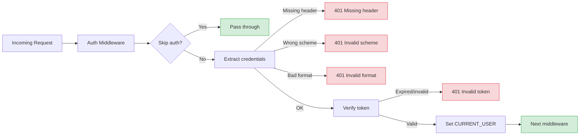

# Authentication -- Error Reference

> Complete error messages and troubleshooting for the authentication module. See [Setup & Configuration](./) for initial setup.

## Error Flow Overview



## Complete Error Reference

All error messages from the authentication module, organized by source.

---

### Component Errors (`AuthenticateComponent`)

Thrown during `binding()` when validating options and configuring services.

| Error Message | Status | Method | When |
|---------------|--------|--------|------|
| `[AuthenticateComponent] At least one of jwtOptions or basicOptions must be provided` | 400 | `binding` | Neither `JWT_OPTIONS` nor `BASIC_OPTIONS` bound in DI container |
| <code v-pre>[AuthenticateComponent] Unknown JOSE standard: {{standard}}</code> | 400 | `binding` | `jwtOptions.standard` is not `'JWS'` or `'JWKS'` |

#### `defineJWSAuth` Errors

| Error Message | Status | Method | When |
|---------------|--------|--------|------|
| <code v-pre>[defineJWSAuth] Invalid jwtSecret &#124; Provided: {{jwtSecret}}</code> | 400 | `defineJWSAuth` | `jwtSecret` is falsy or equals `'unknown_secret'` |
| `[defineJWSAuth] getTokenExpiresFn is required` | 400 | `defineJWSAuth` | `getTokenExpiresFn` not provided in JWS options |

::: info applicationSecret is no longer validated
`applicationSecret` was previously required and validated by the component. It is now **optional** — omitting it simply disables AES payload encryption.
:::

#### `defineJWKSAuth` Errors (Issuer Mode)

| Error Message | Status | Method | When |
|---------------|--------|--------|------|
| `[defineJWKSAuth] keys.private and keys.public are required for issuer mode` | 400 | `defineJWKSAuth` | `keys.private` or `keys.public` missing |
| <code v-pre>[defineJWKSAuth] keys.format is required and must be one of: pem, jwk</code> | 400 | `defineJWKSAuth` | `keys.format` missing or not in `JWKSKeyFormats.SCHEME_SET` |
| `[defineJWKSAuth] kid is required for issuer mode` | 400 | `defineJWKSAuth` | `kid` (Key ID) not provided |
| `[defineJWKSAuth] getTokenExpiresFn is required for issuer mode` | 400 | `defineJWKSAuth` | `getTokenExpiresFn` not provided |

#### `defineJWKSAuth` Errors (Verifier Mode)

| Error Message | Status | Method | When |
|---------------|--------|--------|------|
| `[defineJWKSAuth] jwksUrl is required for verifier mode` | 400 | `defineJWKSAuth` | `jwksUrl` not provided for verifier mode |

#### `defineJWKSAuth` Errors (General)

| Error Message | Status | Method | When |
|---------------|--------|--------|------|
| <code v-pre>[defineJWKSAuth] Invalid JWKS mode: {{mode}}</code> | 400 | `defineJWKSAuth` | `mode` is not `'issuer'` or `'verifier'` |

#### `defineBasicAuth` Errors

| Error Message | Status | Method | When |
|---------------|--------|--------|------|
| `[defineBasicAuth] verifyCredentials function is required` | 400 | `defineBasicAuth` | `BASIC_OPTIONS` bound without a `verifyCredentials` callback |

#### `defineControllers` Errors

| Error Message | Status | Method | When |
|---------------|--------|--------|------|
| `[defineControllers] Auth controller requires jwtOptions to be configured` | 400 | `defineControllers` | `useAuthController: true` but no `jwtOptions` provided |

---

### Bearer Token Service Errors (`AbstractBearerTokenService`)

Base class errors shared by `JWSTokenService`, `JWKSIssuerTokenService`, and `JWKSVerifierTokenService`.

#### `extractCredentials` Errors

| Error Message | Status | Method | When |
|---------------|--------|--------|------|
| `Unauthorized user! Missing authorization header` | 401 | `extractCredentials` | Request has no `Authorization` header |
| `Unauthorized user! Invalid schema of request token!` | 401 | `extractCredentials` | `Authorization` header doesn't start with `Bearer` |
| <code v-pre>Authorization header value is invalid format. It must follow the pattern: 'Bearer xx.yy.zz' where xx.yy.zz is a valid JWT token.</code> | 401 | `extractCredentials` | `Authorization` header doesn't have exactly 2 parts (type + token) |

#### `verify` Errors

| Error Message | Status | Method | When |
|---------------|--------|--------|------|
| `[verify] Invalid request token!` | 401 | `verify` | Token value is empty/falsy |
| `[verify] Invalid or expired token` | 401 | `verify` | `doVerify()` threw — token is expired, malformed, or signature invalid |

::: tip Sanitized error messages
The `verify()` and `generate()` methods use **sanitized error messages** — they do NOT include the original `error.message` in the thrown error. The full error is logged at `error` level for debugging but not exposed to clients.
:::

#### `generate` Errors

| Error Message | Status | Method | When |
|---------------|--------|--------|------|
| `[generate] Invalid token payload!` | 401 | `generate` | Payload is null/undefined |
| `[generate] Failed to generate token` | 500 | `generate` | Signing failed (key issue, algorithm mismatch, etc.) |

---

### JWS Token Service Errors (`JWSTokenService`)

Constructor validation errors thrown during DI resolution.

| Error Message | Status | Method | When |
|---------------|--------|--------|------|
| `[JWSTokenService] Invalid jwtSecret` | 500 | `constructor` | `jwtSecret` is falsy in injected `IJWSTokenServiceOptions` |
| `[JWSTokenService] Invalid getTokenExpiresFn` | 500 | `constructor` | `getTokenExpiresFn` is falsy in injected options |
| `[getSigningKey] Invalid jwtSecret!` | 400 | `getSigningKey` | `jwtSecret` Uint8Array is null (should not happen after constructor validation) |

::: info applicationSecret no longer validated
`JWSTokenService` no longer validates `applicationSecret` in its constructor. If not provided, AES payload encryption is simply disabled.
:::

---

### JWKS Issuer Token Service Errors (`JWKSIssuerTokenService`)

Errors thrown during lazy initialization (`ensureInitialized()`) and key operations.

#### Initialization Errors

| Error Message | Status | Method | When |
|---------------|--------|--------|------|
| <code v-pre>[JWKSIssuerTokenService] Unknown key driver: {{driver}}</code> | 500 | `resolveKeyContent` | `keys.driver` is not `'text'` or `'file'` |
| `[JWKSIssuerTokenService] Invalid raw.priv key!` | 500 | `parseKeyMaterial` | Resolved private key content is empty |
| `[JWKSIssuerTokenService] Invalid raw.pub key!` | 500 | `parseKeyMaterial` | Resolved public key content is empty |
| `[JWKSIssuerTokenService] Invalid JWK key material` | 500 | `parseKeyMaterial` | JWK JSON parsing or `importJWK()` failed (PEM format works, JWK content is invalid) |
| <code v-pre>[JWKSIssuerTokenService] Unknown key format: {{format}}</code> | 500 | `parseKeyMaterial` | `keys.format` is not `'pem'` or `'jwk'` |

::: warning File read errors
When using `JWKSKeyDrivers.FILE`, file read errors from `readFile()` propagate as Node.js filesystem errors (e.g., `ENOENT`, `EACCES`). These are **not** wrapped — the raw error surfaces during initialization.
:::

#### Runtime Errors

| Error Message | Status | Method | When |
|---------------|--------|--------|------|
| `[getSigningKey] Invalid privateKey!` | 400 | `getSigningKey` | Private key is null (initialization incomplete or failed) |
| `[JWKSIssuerTokenService] JWKS not initialized yet. Call getJWKSAsync() instead.` | 500 | `getJWKS` | Sync `getJWKS()` called before lazy init completed |

---

### JWKS Verifier Token Service Errors (`JWKSVerifierTokenService`)

| Error Message | Status | Method | When |
|---------------|--------|--------|------|
| `[JWKSVerifierTokenService] Verifier mode cannot sign tokens` | 500 | `getSigner` | Attempt to call `generate()` on a verify-only service |
| `[JWKSVerifierTokenService] Verifier mode cannot sign tokens` | 500 | `getSigningKey` | Attempt to access signing key on a verify-only service |
| `[JWKSVerifierTokenService] Verifier mode has no token expiry` | 500 | `getDefaultTokenExpiresFn` | Attempt to access token expiry on a verify-only service |

::: tip Verifier mode is read-only
`JWKSVerifierTokenService` **cannot** generate tokens. Calling `generate()` throws because both `getSigner()` and `getSigningKey()` throw. Only `verify()` and `extractCredentials()` are functional.
:::

---

### Basic Token Service Errors (`BasicTokenService`)

| Error Message | Status | Method | When |
|---------------|--------|--------|------|
| `[BasicTokenService] Invalid verifyCredentials function` | 500 | `constructor` | `verifyCredentials` not provided in injected `TBasicTokenServiceOptions` |
| `Unauthorized! Missing authorization header` | 401 | `extractCredentials` | Request has no `Authorization` header |
| `Unauthorized! Invalid authorization schema, expected Basic` | 401 | `extractCredentials` | `Authorization` header doesn't start with `Basic` |
| `Unauthorized! Invalid authorization header format` | 401 | `extractCredentials` | Header doesn't have exactly 2 parts (`Basic` + base64 value) |
| `Unauthorized! Invalid base64 credentials format` | 401 | `extractCredentials` | Base64 decoding failed, no colon separator, or empty username |
| `Unauthorized! Invalid username or password` | 401 | `verify` | `verifyCredentials` callback returned null/falsy |

---

### Strategy Registry Errors (`AuthenticationStrategyRegistry`)

Inherited from `AbstractAuthRegistry`.

| Error Message | Status | Method | When |
|---------------|--------|--------|------|
| <code v-pre>[getKey] Invalid name &#124; name: {{name}}</code> | 400 | `getKey` | Strategy name is empty or falsy |
| <code v-pre>[AuthenticationStrategyRegistry] No items registered</code> | 400 | `getDefaultName` | No strategies have been registered |
| <code v-pre>[AuthenticationStrategyRegistry] Descriptor not found: {{name}}</code> | 400 | `resolveDescriptor` | Strategy with given name is not registered |
| <code v-pre>[AuthenticationStrategyRegistry] Failed to resolve: {{name}}</code> | 400 | `resolveDescriptor` | Strategy registered but DI container returned null |

---

### Authentication Provider Errors (`AuthenticationProvider`)

The middleware that executes strategies in the configured mode.

| Error Message | Status | Method | When |
|---------------|--------|--------|------|
| <code v-pre>Authentication failed. Tried strategies: {{strategies}}</code> | 401 | `executeAnyMode` | All strategies failed in `'any'` mode — each strategy threw during `authenticate()` |
| `Failed to identify authenticated user!` | 401 | `executeAllMode` | All strategies succeeded in `'all'` mode but the final `authUser.userId` is falsy |
| <code v-pre>Invalid authentication mode &#124; mode: {{mode}}</code> | 500 | `createAuthenticateMiddleware` | `mode` is not `'any'` or `'all'` |

---

### Auth Controller Factory Errors

| Error Message | Status | Method | When |
|---------------|--------|--------|------|
| `[AuthController] Failed to init auth controller \| Invalid injectable authentication service!` | 400 | `constructor` | DI could not resolve the authentication service (service key not bound) |

---

## Troubleshooting

### "[AuthenticateComponent] At least one of jwtOptions or basicOptions must be provided"

**Cause:** The component requires at least one authentication method. Neither `JWT_OPTIONS` nor `BASIC_OPTIONS` was bound before calling `this.component(AuthenticateComponent)`.

**Fix:** Bind at least one set of options before registering the component:

```typescript
// Option A: JWS (symmetric JWT)
this.bind<TJWTTokenServiceOptions>({ key: AuthenticateBindingKeys.JWT_OPTIONS }).toValue({
  standard: JOSEStandards.JWS,
  options: {
    jwtSecret: env.get('JWT_SECRET'),
    getTokenExpiresFn: () => 86_400,
  },
});

// Option B: JWKS Issuer (asymmetric JWT)
this.bind<TJWTTokenServiceOptions>({ key: AuthenticateBindingKeys.JWT_OPTIONS }).toValue({
  standard: JOSEStandards.JWKS,
  options: {
    mode: JWKSModes.ISSUER,
    algorithm: 'RS256',
    kid: 'my-key-1',
    keys: { driver: JWKSKeyDrivers.FILE, format: JWKSKeyFormats.PEM, private: './keys/private.pem', public: './keys/public.pem' },
    getTokenExpiresFn: () => 86_400,
  },
});

// Then register the component
this.component(AuthenticateComponent);
```

### "[defineJWSAuth] Invalid jwtSecret"

**Cause:** `jwtSecret` is missing, empty, or set to the default placeholder `'unknown_secret'`. The component validates this during `defineJWSAuth()`.

**Fix:** Set a strong, unique JWT secret:

```bash
# .env
JWT_SECRET=your-strong-jwt-secret-at-least-32-chars
```

```typescript
this.bind<TJWTTokenServiceOptions>({ key: AuthenticateBindingKeys.JWT_OPTIONS }).toValue({
  standard: JOSEStandards.JWS,
  options: {
    jwtSecret: env.get('JWT_SECRET'),
    getTokenExpiresFn: () => 86_400,
  },
});
```

### "[defineJWSAuth] getTokenExpiresFn is required"

**Cause:** `getTokenExpiresFn` was not provided in the JWS options.

**Fix:** Include a function that returns the token expiry time in seconds:

```typescript
options: {
  jwtSecret: env.get('JWT_SECRET'),
  getTokenExpiresFn: () => Number(env.get('JWT_EXPIRES_IN') || 86_400),
}
```

### "[defineJWKSAuth] keys.private and keys.public are required for issuer mode"

**Cause:** JWKS issuer mode requires both a private key (for signing) and a public key (for the `/certs` JWKS endpoint). One or both were not provided.

**Fix:** Provide both keys in the options:

```typescript
options: {
  mode: JWKSModes.ISSUER,
  algorithm: 'RS256',
  kid: 'my-key-1',
  keys: {
    driver: JWKSKeyDrivers.FILE,
    format: JWKSKeyFormats.PEM,
    private: './keys/private.pem',
    public: './keys/public.pem',
  },
  getTokenExpiresFn: () => 86_400,
}
```

### "[defineJWKSAuth] keys.format is required and must be one of: pem, jwk"

**Cause:** `keys.format` is missing or invalid. The component validates against `JWKSKeyFormats.SCHEME_SET` (values are lowercase: `'pem'`, `'jwk'`).

**Fix:** Use one of the supported formats:

```typescript
keys: {
  driver: JWKSKeyDrivers.FILE,
  format: JWKSKeyFormats.PEM,  // or JWKSKeyFormats.JWK
  private: './keys/private.pem',
  public: './keys/public.pem',
}
```

### "[defineJWKSAuth] kid is required for issuer mode"

**Cause:** The Key ID (`kid`) is required for the issuer to include in the JWKS and JWT headers. It allows verifiers to identify which key was used to sign a token.

**Fix:** Provide a unique key identifier:

```typescript
options: {
  mode: JWKSModes.ISSUER,
  kid: 'my-service-key-2024',
  // ...
}
```

### "[defineJWKSAuth] jwksUrl is required for verifier mode"

**Cause:** JWKS verifier mode needs the URL of the issuer's `/certs` endpoint to fetch the public key set.

**Fix:** Provide the JWKS endpoint URL:

```typescript
this.bind<TJWTTokenServiceOptions>({ key: AuthenticateBindingKeys.JWT_OPTIONS }).toValue({
  standard: JOSEStandards.JWKS,
  options: {
    mode: JWKSModes.VERIFIER,
    jwksUrl: 'https://auth-service.example.com/certs',
  },
});
```

### "[JWKSIssuerTokenService] Invalid JWK key material"

**Cause:** When using `JWKSKeyFormats.JWK`, the private or public key content failed to parse as valid JSON, or `importJWK()` rejected it. The full error is logged at `error` level.

**Fix:** Ensure your JWK keys are valid JSON objects:

```json
{
  "kty": "RSA",
  "n": "...",
  "e": "AQAB",
  "d": "...",
  "alg": "RS256",
  "use": "sig"
}
```

If stored as files, ensure the file contains valid JSON (not PEM). If stored as text (`JWKSKeyDrivers.TEXT`), ensure the string is parseable JSON.

### "[JWKSIssuerTokenService] JWKS not initialized yet. Call getJWKSAsync() instead."

**Cause:** `getJWKS()` (synchronous) was called before the lazy initialization completed. The issuer loads keys asynchronously on first use.

**Fix:** Use the async variant:

```typescript
const jwks = await issuerService.getJWKSAsync();
```

The built-in `JWKSController` already uses `getJWKSAsync()`, so this error only occurs if you call `getJWKS()` directly in custom code.

### "[JWKSVerifierTokenService] Verifier mode cannot sign tokens"

**Cause:** `generate()` was called on a `JWKSVerifierTokenService`. The verifier mode only has access to public keys (via the remote JWKS URL) and cannot sign tokens.

**Fix:** Token generation should only happen on the **issuer** service. If you need both signing and verification in the same application, use `JWKSModes.ISSUER` — the issuer can both sign and verify.

### "Authentication failed. Tried strategies: jwt, jwks"

**Cause:** All configured strategies failed in `'any'` mode. Each strategy attempted to authenticate the request and threw.

**Fix:** Verify the client is sending the correct `Authorization` header:
- For Bearer (JWS/JWKS): `Authorization: Bearer <token>`
- For Basic: `Authorization: Basic <base64(username:password)>`

Common causes:
- Token expired
- Token signed with a different key
- Wrong strategy name in route config (e.g., `'jwt'` when using JWKS)
- Strategy not registered (see below)

### "[AuthenticationStrategyRegistry] Descriptor not found: jwt"

**Cause:** A route references strategy name `'jwt'` but no strategy with that name has been registered in the `AuthenticationStrategyRegistry`.

**Fix:** Strategies are **not auto-registered** by `AuthenticateComponent`. You must manually register them after the component:

```typescript
// In preConfigure() or after component registration
this.component(AuthenticateComponent);

// Manual strategy registration
AuthenticationStrategyRegistry.getInstance().register({
  container: this,
  strategies: [
    { strategy: JWSAuthenticationStrategy, name: 'jwt' },
  ],
});
```

See [Usage & Examples](./usage#strategy-registration) for the full registration flow.

### "[AuthController] Failed to init auth controller | Invalid injectable authentication service!"

**Cause:** The auth controller factory could not resolve the authentication service from DI. The service key (configured via `controllerOpts.serviceKey`) is not bound.

**Fix:** Register your `AuthenticationService` before registering the component:

```typescript
// 1. Register your auth service
this.service(AuthenticationService);

// 2. Configure REST options with matching service key
this.bind<TAuthenticationRestOptions>({ key: AuthenticateBindingKeys.REST_OPTIONS }).toValue({
  useAuthController: true,
  controllerOpts: {
    restPath: '/auth',
    serviceKey: 'services.AuthenticationService',
  },
});

// 3. Register component
this.component(AuthenticateComponent);
```

### "[defineBasicAuth] verifyCredentials function is required"

**Cause:** `BASIC_OPTIONS` was bound but without a `verifyCredentials` callback.

**Fix:** Provide a `verifyCredentials` function:

```typescript
this.bind<TBasicTokenServiceOptions>({ key: AuthenticateBindingKeys.BASIC_OPTIONS }).toValue({
  verifyCredentials: async ({ credentials, context }) => {
    const user = await userRepo.findByUsername(credentials.username);
    if (user && await bcrypt.compare(credentials.password, user.passwordHash)) {
      return { userId: user.id };
    }
    return null;
  },
});
```

### "[verify] Invalid or expired token"

**Cause:** Token verification failed. This is a sanitized error — the original error (expired, wrong signature, malformed) is logged internally but not exposed to clients.

**Fix:** Check the application logs for the full error. Common causes:
- Token has expired (check `exp` claim)
- Token signed with a different secret/key
- Token was tampered with
- Algorithm mismatch between signing and verification

```bash
# Look for the full error in logs
grep "Failed to verify token" logs/application.log
```

---

## Error Categories

```mermaid
flowchart TB
    subgraph S400["Startup Errors (400)"]
        direction TB
        A1["Missing options"]
        A2["Invalid secrets"]
        A3["Missing functions"]
        A4["JWKS key validation"]
        A5["Mode validation"]
        A6["DI resolution"]
    end

    subgraph S401["Runtime Errors (401)"]
        direction TB
        B1["Missing header"]
        B2["Wrong scheme"]
        B3["Invalid format"]
        B4["Token verification"]
        B5["Credential verification"]
        B6["Strategy exhaustion"]
    end

    subgraph S500["Structural Errors (500)"]
        direction TB
        C1["Unsupported operation"]
        C2["Uninitialized state"]
        C3["Key/file I/O errors"]
        C4["Invalid auth mode"]
    end

    style S400 fill:#fff3cd,stroke:#ffc107
    style S401 fill:#f8d7da,stroke:#dc3545
    style S500 fill:#d1ecf1,stroke:#0dcaf0
```



### Startup Errors (400)

These errors prevent the application from starting. They occur during component binding or DI resolution. The component uses `getError()` without an explicit status code, which defaults to **400**.

| Category | Errors | When |
|----------|--------|------|
| Missing options | `At least one of jwtOptions or basicOptions` | No auth options bound |
| Invalid secrets | `Invalid jwtSecret` | JWS secret missing or placeholder |
| Missing functions | `getTokenExpiresFn is required` | No expiry function |
| JWKS key validation | `keys.private and keys.public are required` | Missing key material |
| JWKS format validation | `keys.format is required` | Invalid key format |
| Mode validation | `Unknown JOSE standard`, `Invalid JWKS mode` | Invalid discriminated union value |
| DI resolution | `Invalid injectable authentication service` | Service not registered |

::: info Why 400 and not 500?
The `AuthenticateComponent` and `AbstractAuthRegistry` use `getError({ message })` without specifying `statusCode`. The `getError()` helper defaults to `statusCode: 400`. Service-level initialization errors (file I/O, key parsing) explicitly set `statusCode: 500`.
:::

### Runtime Errors (401)

These errors occur during request processing and return `401 Unauthorized` to clients.

| Category | Errors | When |
|----------|--------|------|
| Missing header | `Missing authorization header` | No `Authorization` header |
| Wrong scheme | `Invalid schema of request token` | Header uses wrong auth type |
| Invalid format | `Invalid authorization header format` | Malformed header value |
| Token verification | `Invalid or expired token` | JWT verification failed |
| Credential verification | `Invalid username or password` | Basic auth credentials rejected |
| Strategy exhaustion | `Authentication failed. Tried strategies:` | All strategies failed |

### Structural Errors (500)

These errors indicate programming mistakes, I/O failures, or misconfiguration that should be fixed in code.

| Category | Errors | When |
|----------|--------|------|
| Unsupported operation | `Verifier mode cannot sign tokens` | Wrong service used for signing |
| Uninitialized state | `JWKS not initialized yet` | Sync access before async init |
| Key/file I/O errors | `Unknown key driver`, `Invalid raw.priv key`, `Invalid JWK key material` | JWKS key loading/parsing failed |
| Invalid mode | `Invalid authentication mode` | Unknown mode passed to provider |

---

## See Also

- [Setup & Configuration](./) -- Binding keys, options interfaces, and initial setup
- [Usage & Examples](./usage) -- Securing routes, auth flows, and API endpoints
- [API Reference](./api) -- Architecture, service internals, and strategy registry
