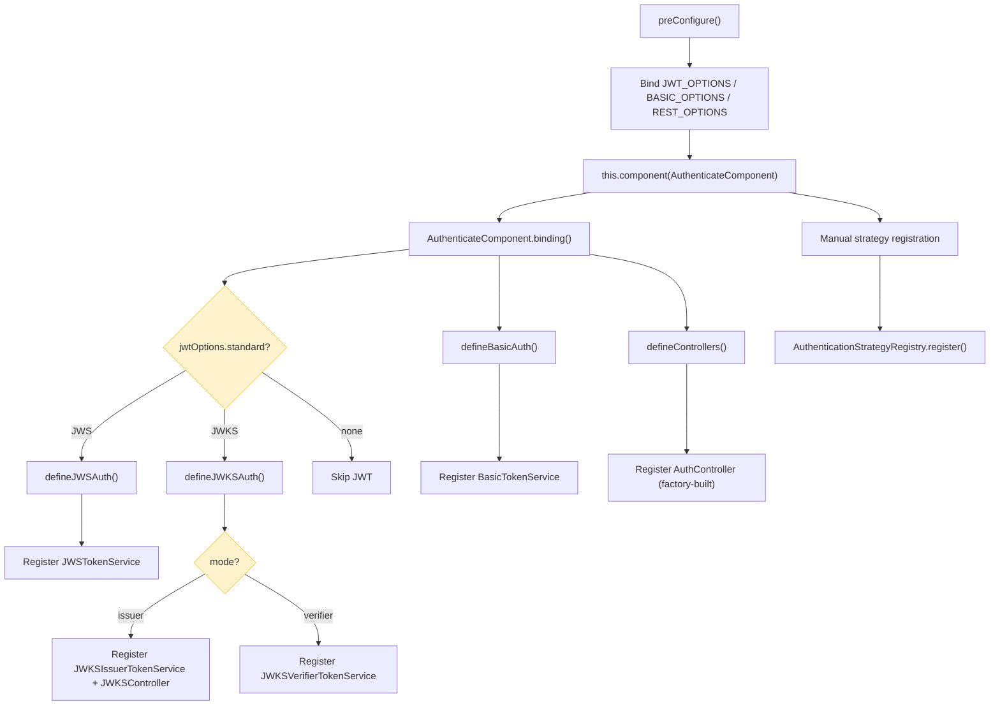
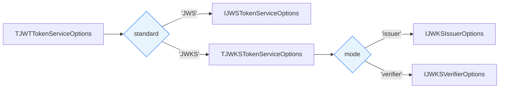

# Authentication -- Setup & Configuration

> JWT authentication with JWS (symmetric) and JWKS (asymmetric) standards, optional AES-encrypted payloads, Basic HTTP authentication, multi-strategy support, and built-in auth controller

## Quick Reference

| Item | Value |
|------|-------|
| **Package** | `@venizia/ignis` |
| **Class** | `AuthenticateComponent` |
| **Runtimes** | Both |

### Key Components

| Component | Purpose |
|-----------|---------|
| **AuthenticateComponent** | Main component registering auth services and controllers |
| **AuthenticationStrategyRegistry** | Singleton managing available auth strategies |
| **JWSAuthenticationStrategy** | JWT verification using symmetric `JWSTokenService` (HS256) |
| **JWKSIssuerAuthenticationStrategy** | JWT verification using asymmetric `JWKSIssuerTokenService` (ES256/RS256/EdDSA) |
| **JWKSVerifierAuthenticationStrategy** | JWT verification via remote JWKS URL |
| **BasicAuthenticationStrategy** | Basic HTTP authentication using `BasicTokenService` |
| **AbstractBearerTokenService** | Base class for all Bearer token services (JWS, JWKS Issuer, JWKS Verifier) |
| **JWSTokenService** | Symmetric JWT — sign, verify, optional AES encrypt/decrypt |
| **JWKSIssuerTokenService** | Asymmetric JWT — sign with private key, verify with public key, serve JWKS endpoint |
| **JWKSVerifierTokenService** | Asymmetric JWT — verify-only via remote JWKS URL |
| **BasicTokenService** | Extract and verify Basic auth credentials |
| **JWKSController** | Serves `/.well-known/jwks.json`-style endpoint at `/certs` |
| **IAuthService** | Interface for custom auth implementation (sign-in, sign-up) |
| **defineAuthController** | Factory function for creating custom auth controllers |
| **AbstractJWKSTokenService** | Base class for JWKS services with lazy initialization and retry-on-failure |
| **authenticate** | Standalone middleware function using `AuthenticationProvider` to create auth middleware |

### JOSE Standards

The authentication module supports two JOSE (JSON Object Signing and Encryption) standards:

| Standard | Class | Use Case | Signing | Key Type |
|----------|-------|----------|---------|----------|
| **JWS** | `JWSTokenService` | Single-service apps where the same service signs and verifies | HS256 (symmetric) | Shared secret (`jwtSecret`) |
| **JWKS (Issuer)** | `JWKSIssuerTokenService` | Multi-service / microservice architectures where one service issues tokens | ES256 / RS256 / EdDSA (asymmetric) | Private key (sign) + Public key (verify) |
| **JWKS (Verifier)** | `JWKSVerifierTokenService` | Services that only verify tokens issued by another service | N/A (verify-only) | Remote JWKS URL |

### Environment Variables

| Variable | Purpose | Required |
|----------|---------|----------|
| `APP_ENV_JWT_SECRET` | Sign and verify JWT signature (JWS only) | Required for JWS |
| `APP_ENV_APPLICATION_SECRET` | AES-encrypt JWT payload fields | Optional |
| `APP_ENV_JWT_EXPIRES_IN` | Token expiration (seconds) | Required |
| `APP_ENV_JWKS_ALGORITHM` | JWKS signing algorithm (e.g., `ES256`) | Required for JWKS |
| `APP_ENV_JWKS_KEY_DRIVER` | Key source: `text` or `file` | Required for JWKS |
| `APP_ENV_JWKS_KEY_FORMAT` | Key format: `pem` or `jwk` | Required for JWKS |
| `APP_ENV_JWKS_PRIVATE_KEY` | Private key content or file path | Required for JWKS Issuer |
| `APP_ENV_JWKS_PUBLIC_KEY` | Public key content or file path | Required for JWKS Issuer |
| `APP_ENV_JWKS_KID` | Key ID for JWKS endpoint | Required for JWKS Issuer |

### Auth Modes

| Mode | Behavior |
|------|----------|
| `'any'` | First successful strategy wins (fallback mode) |
| `'all'` | All strategies must pass (MFA mode) |

### Token Types

| Constant | Value | Description |
|----------|-------|-------------|
| `AuthenticationTokenTypes.TYPE_AUTHORIZATION_CODE` | `'000_AUTHORIZATION_CODE'` | Authorization code grant type |
| `AuthenticationTokenTypes.TYPE_ACCESS_TOKEN` | `'100_ACCESS_TOKEN'` | Access token type |
| `AuthenticationTokenTypes.TYPE_REFRESH_TOKEN` | `'200_REFRESH_TOKEN'` | Refresh token type |

### Authentication Constants

| Constant | Value | Description |
|----------|-------|-------------|
| `Authentication.AUTHENTICATION_STRATEGY` | `'authentication.strategy'` | Namespace prefix for strategy binding keys |
| `Authentication.STRATEGY_JWT` | `'jwt'` | JWT strategy name |
| `Authentication.STRATEGY_BASIC` | `'basic'` | Basic strategy name |
| `Authentication.TYPE_BEARER` | `'Bearer'` | Bearer token type prefix |
| `Authentication.TYPE_BASIC` | `'Basic'` | Basic token type prefix |
| `Authentication.SKIP_AUTHENTICATION` | `'authentication.skip'` | Context key to dynamically skip auth |
| `Authentication.CURRENT_USER` | `'auth.current.user'` | Context key for the authenticated user payload |
| `Authentication.AUDIT_USER_ID` | `'audit.user.id'` | Context key for the authenticated user ID |

### JWKS Constants

| Class | Constant | Value | Description |
|-------|----------|-------|-------------|
| `JOSEStandards` | `JWS` | `'JWS'` | Symmetric JWT standard |
| `JOSEStandards` | `JWKS` | `'JWKS'` | Asymmetric JWT standard |
| `JWKSModes` | `ISSUER` | `'issuer'` | Issuer mode (sign + verify + serve JWKS) |
| `JWKSModes` | `VERIFIER` | `'verifier'` | Verifier mode (verify-only via remote JWKS) |
| `JWKSKeyDrivers` | `TEXT` | `'text'` | Key provided as inline text |
| `JWKSKeyDrivers` | `FILE` | `'file'` | Key loaded from file path |
| `JWKSKeyFormats` | `PEM` | `'pem'` | PEM-encoded key format |
| `JWKSKeyFormats` | `JWK` | `'jwk'` | JSON Web Key format |

Each constants class also provides:
- `SCHEME_SET: Set<string>` — set of all valid values
- `isValid(input: string): boolean` — check if a value is recognized

#### Import Paths

```typescript
import {
  // Component + Registry
  AuthenticateComponent,
  AuthenticateBindingKeys,
  Authentication,
  AuthenticationModes,
  AuthenticationTokenTypes,
  AuthenticationStrategyRegistry,

  // JOSE Standards + Constants
  JOSEStandards,
  JWKSModes,
  JWKSKeyDrivers,
  JWKSKeyFormats,

  // Strategies
  JWSAuthenticationStrategy,
  JWKSIssuerAuthenticationStrategy,
  JWKSVerifierAuthenticationStrategy,
  BasicAuthenticationStrategy,

  // Services
  AbstractBearerTokenService,
  JWSTokenService,
  JWKSIssuerTokenService,
  JWKSVerifierTokenService,
  BasicTokenService,

  // Controllers
  defineAuthController,
  JWKSController,
  authenticate,
} from '@venizia/ignis';

import type {
  // Option types
  TAuthenticationRestOptions,
  TJWTTokenServiceOptions,
  IJWSTokenServiceOptions,
  IJWKSIssuerOptions,
  IJWKSVerifierOptions,
  TJWKSTokenServiceOptions,
  TBasicTokenServiceOptions,
  IAuthenticateOptions,

  // User + payload types
  IAuthUser,
  IJWTTokenPayload,
  IAuthService,
  IAuthenticationStrategy,

  // Controller types
  TDefineAuthControllerOpts,

  // Utility types
  TAuthStrategy,
  TAuthMode,
  TGetTokenExpiresFn,
  TJWKSAlgorithm,
  TJWKSKeyDriver,
  TJWKSKeyFormat,
  TJOSEStandard,
  TJWKSMode,
} from '@venizia/ignis';
```

#### Entity Column Helper Imports

```typescript
import {
  extraUserColumns,
  extraRoleColumns,
  extraPermissionColumns,
  extraPermissionMappingColumns,
  extraUserRoleColumns,
} from '@venizia/ignis';

import type {
  TPermissionOptions,
  TPermissionCommonColumns,
  TPermissionMappingOptions,
  TPermissionMappingCommonColumns,
  TUserRoleOptions,
  TUserRoleCommonColumns,
} from '@venizia/ignis';
```

#### Status and Type Imports

```typescript
import {
  UserStatuses,
  UserTypes,
  RoleStatuses,
} from '@venizia/ignis';
```

## Component Binding Lifecycle



## Setup

### Step 1: Bind Configuration

Bind JWT options using the discriminated union `TJWTTokenServiceOptions`, which requires a `standard` field to select the JOSE standard.

### JWS (Symmetric JWT) Setup

```typescript
import {
  AuthenticateBindingKeys,
  JOSEStandards,
  TJWTTokenServiceOptions,
} from '@venizia/ignis';

this.bind<TJWTTokenServiceOptions>({ key: AuthenticateBindingKeys.JWT_OPTIONS }).toValue({
  standard: JOSEStandards.JWS,
  options: {
    jwtSecret: process.env.APP_ENV_JWT_SECRET,
    applicationSecret: process.env.APP_ENV_APPLICATION_SECRET, // Optional — enables AES payload encryption
    getTokenExpiresFn: () => Number(process.env.APP_ENV_JWT_EXPIRES_IN || 86400),
  },
});
```

**Example `.env` file (JWS):**

```
APP_ENV_JWT_SECRET=your-strong-jwt-secret
APP_ENV_APPLICATION_SECRET=your-strong-application-secret
APP_ENV_JWT_EXPIRES_IN=86400
```

> [!NOTE]
> `applicationSecret` is optional. When provided, all custom JWT claim keys and values are AES-encrypted. When omitted, payloads are stored in plaintext (standard JWT behavior).

### JWKS Issuer (Asymmetric JWT) Setup

```typescript
import {
  AuthenticateBindingKeys,
  JOSEStandards,
  JWKSModes,
  JWKSKeyDrivers,
  JWKSKeyFormats,
  TJWTTokenServiceOptions,
} from '@venizia/ignis';

this.bind<TJWTTokenServiceOptions>({ key: AuthenticateBindingKeys.JWT_OPTIONS }).toValue({
  standard: JOSEStandards.JWKS,
  options: {
    mode: JWKSModes.ISSUER,
    algorithm: 'ES256',
    keys: {
      driver: JWKSKeyDrivers.FILE,     // or JWKSKeyDrivers.TEXT
      format: JWKSKeyFormats.PEM,       // or JWKSKeyFormats.JWK
      private: './keys/private.pem',
      public: './keys/public.pem',
    },
    kid: 'my-key-id-1',
    getTokenExpiresFn: () => Number(process.env.APP_ENV_JWT_EXPIRES_IN || 86400),
    // Optional AES payload encryption
    aesAlgorithm: 'aes-256-cbc',
    applicationSecret: process.env.APP_ENV_APPLICATION_SECRET,
  },
});
```

**Example `.env` file (JWKS Issuer):**

```
APP_ENV_JWKS_ALGORITHM=ES256
APP_ENV_JWKS_KEY_DRIVER=file
APP_ENV_JWKS_KEY_FORMAT=pem
APP_ENV_JWKS_PRIVATE_KEY=./keys/private.pem
APP_ENV_JWKS_PUBLIC_KEY=./keys/public.pem
APP_ENV_JWKS_KID=my-key-id-1
APP_ENV_JWT_EXPIRES_IN=86400
APP_ENV_APPLICATION_SECRET=your-strong-application-secret
```

### JWKS Verifier (Remote Verification) Setup

```typescript
import {
  AuthenticateBindingKeys,
  JOSEStandards,
  JWKSModes,
  TJWTTokenServiceOptions,
} from '@venizia/ignis';

this.bind<TJWTTokenServiceOptions>({ key: AuthenticateBindingKeys.JWT_OPTIONS }).toValue({
  standard: JOSEStandards.JWKS,
  options: {
    mode: JWKSModes.VERIFIER,
    jwksUrl: 'https://auth-service.example.com/certs',
    cacheTtlMs: 43_200_000,  // Cache JWKS for 12 hours (default)
    cooldownMs: 30_000,       // Wait 30s between JWKS refreshes (default)
    // Optional AES payload decryption (must match issuer's applicationSecret)
    aesAlgorithm: 'aes-256-cbc',
    applicationSecret: process.env.APP_ENV_APPLICATION_SECRET,
  },
});
```

### Basic Auth Only (Alternative Setup)

```typescript
import {
  AuthenticateBindingKeys,
  TBasicTokenServiceOptions,
} from '@venizia/ignis';

this.bind<TBasicTokenServiceOptions>({ key: AuthenticateBindingKeys.BASIC_OPTIONS }).toValue({
  verifyCredentials: async (opts) => {
    const { credentials, context } = opts;
    const user = await userRepo.findByUsername(credentials.username);
    if (user && await bcrypt.compare(credentials.password, user.passwordHash)) {
      return { userId: user.id, roles: user.roles };
    }
    return null;
  },
});
```

### Combined JWKS + Basic with Auth Controller (Full Setup)

```typescript
import {
  AuthenticateBindingKeys,
  JOSEStandards,
  JWKSModes,
  JWKSKeyDrivers,
  JWKSKeyFormats,
  TJWTTokenServiceOptions,
  TBasicTokenServiceOptions,
  TAuthenticationRestOptions,
  BindingKeys,
  BindingNamespaces,
} from '@venizia/ignis';

// Bind REST options (enables auth controller)
this.bind<TAuthenticationRestOptions>({ key: AuthenticateBindingKeys.REST_OPTIONS }).toValue({
  useAuthController: true,
  controllerOpts: {
    restPath: '/auth',
    serviceKey: BindingKeys.build({
      namespace: BindingNamespaces.SERVICE,
      key: AuthenticationService.name,
    }),
    payload: {
      signIn: {
        request: { schema: SignInRequestSchema },
        response: { schema: SignInResponseSchema },
      },
      signUp: {
        request: { schema: SignUpRequestSchema },
        response: { schema: SignUpResponseSchema },
      },
      changePassword: {
        request: { schema: ChangePasswordRequestSchema },
        response: { schema: ChangePasswordResponseSchema },
      },
    },
  },
});

// Bind JWT options (JWKS issuer mode)
this.bind<TJWTTokenServiceOptions>({ key: AuthenticateBindingKeys.JWT_OPTIONS }).toValue({
  standard: JOSEStandards.JWKS,
  options: {
    mode: JWKSModes.ISSUER,
    algorithm: 'ES256',
    keys: {
      driver: JWKSKeyDrivers.FILE,
      format: JWKSKeyFormats.PEM,
      private: './keys/private.pem',
      public: './keys/public.pem',
    },
    kid: 'my-key-id-1',
    getTokenExpiresFn: () => Number(process.env.APP_ENV_JWT_EXPIRES_IN || 86400),
  },
});

// Bind Basic auth options
this.bind<TBasicTokenServiceOptions>({ key: AuthenticateBindingKeys.BASIC_OPTIONS }).toValue({
  verifyCredentials: async (opts) => {
    const authenticateService = this.get<AuthenticationService>({
      key: BindingKeys.build({
        namespace: BindingNamespaces.SERVICE,
        key: AuthenticationService.name,
      }),
    });
    return authenticateService.signIn(opts.context, {
      identifier: { scheme: 'username', value: opts.credentials.username },
      credential: { scheme: 'basic', value: opts.credentials.password },
    });
  },
});
```

### Step 2: Register Component and Strategies

```typescript
import {
  AuthenticateComponent,
  Authentication,
  AuthenticationStrategyRegistry,
  JWKSIssuerAuthenticationStrategy,
  BasicAuthenticationStrategy,
  BaseApplication,
  ValueOrPromise,
} from '@venizia/ignis';

export class Application extends BaseApplication {
  preConfigure(): ValueOrPromise<void> {
    // Register your auth service (if using auth controller)
    this.service(AuthenticationService);

    // Step 1 bindings here...

    // Register component
    this.component(AuthenticateComponent);

    // Register strategies manually AFTER the component
    AuthenticationStrategyRegistry.getInstance().register({
      container: this,
      strategies: [
        { name: Authentication.STRATEGY_JWT, strategy: JWKSIssuerAuthenticationStrategy },
        { name: Authentication.STRATEGY_BASIC, strategy: BasicAuthenticationStrategy },
      ],
    });
  }
}
```

> [!IMPORTANT]
> Strategies are NOT auto-registered by `AuthenticateComponent`. You must manually register them after calling `this.component(AuthenticateComponent)`. This gives you full control over which strategies are available.

> [!NOTE]
> Choose the strategy class matching your JOSE standard:
> - JWS: `JWSAuthenticationStrategy`
> - JWKS Issuer: `JWKSIssuerAuthenticationStrategy`
> - JWKS Verifier: `JWKSVerifierAuthenticationStrategy`

## Configuration

### TJWTTokenServiceOptions (Discriminated Union)



The top-level JWT options use a discriminated union on the `standard` field:

```typescript
type TJWTTokenServiceOptions =
  | { standard: typeof JOSEStandards.JWS; options: IJWSTokenServiceOptions }
  | { standard: typeof JOSEStandards.JWKS; options: TJWKSTokenServiceOptions };
```

This enables clean TypeScript narrowing — once you set `standard: JOSEStandards.JWS`, the `options` field is typed as `IJWSTokenServiceOptions`; with `standard: JOSEStandards.JWKS`, it becomes `TJWKSTokenServiceOptions`.

### JWS Options (IJWSTokenServiceOptions)

| Option | Type | Default | Required | Description |
|--------|------|---------|----------|-------------|
| `jwtSecret` | `string` | -- | Yes | Secret for signing and verifying JWT signature |
| `getTokenExpiresFn` | `TGetTokenExpiresFn` | -- | Yes | Function returning token expiration in seconds |
| `applicationSecret` | `string` | -- | No | Secret for AES-encrypting JWT payload fields |
| `aesAlgorithm` | `AESAlgorithmType` | `'aes-256-cbc'` | No | AES algorithm for payload encryption |
| `headerAlgorithm` | `string` | `'HS256'` | No | JWT signing algorithm |

```typescript
interface IJWSTokenServiceOptions {
  headerAlgorithm?: string;
  jwtSecret: string;
  getTokenExpiresFn: TGetTokenExpiresFn;
  aesAlgorithm?: AESAlgorithmType;
  applicationSecret?: string;
}
```

> [!WARNING]
> `jwtSecret` is mandatory. The component will throw an error if it is missing or set to `'unknown_secret'`. The error message from `defineJWSAuth` **includes the actual provided secret value** in the error output, so ensure these errors are never exposed to end users.

> [!NOTE]
> `applicationSecret` is optional. When provided, custom JWT payload fields are AES-encrypted (keys and values). When omitted, the JWT payload is stored in standard plaintext. Standard JWT fields (`iss`, `sub`, `aud`, `jti`, `nbf`, `exp`, `iat`) are never encrypted.

### JWKS Issuer Options (IJWKSIssuerOptions)

| Option | Type | Default | Required | Description |
|--------|------|---------|----------|-------------|
| `mode` | `typeof JWKSModes.ISSUER` | -- | Yes | Must be `'issuer'` |
| `algorithm` | `TJWKSAlgorithm` | -- | Yes | Signing algorithm: `'ES256'`, `'RS256'`, or `'EdDSA'` |
| `keys.driver` | `TJWKSKeyDriver` | -- | Yes | Key source: `'text'` (inline) or `'file'` (file path) |
| `keys.format` | `TJWKSKeyFormat` | -- | Yes | Key format: `'pem'` or `'jwk'` |
| `keys.private` | `string` | -- | Yes | Private key content (text) or file path (file) |
| `keys.public` | `string` | -- | Yes | Public key content (text) or file path (file) |
| `kid` | `string` | -- | Yes | Key ID exposed in the JWKS endpoint |
| `getTokenExpiresFn` | `TGetTokenExpiresFn` | -- | Yes | Function returning token expiration in seconds |
| `rest` | `{ path: string }` | `{ path: '/certs' }` | No | Custom path for the JWKS endpoint |
| `aesAlgorithm` | `AESAlgorithmType` | `'aes-256-cbc'` | No | AES algorithm for payload encryption |
| `applicationSecret` | `string` | -- | No | Secret for AES-encrypting JWT payload fields |

```typescript
interface IJWKSIssuerOptions {
  mode: typeof JWKSModes.ISSUER;
  algorithm: TJWKSAlgorithm;
  rest?: { path: string };
  keys: {
    driver: TJWKSKeyDriver;
    format: TJWKSKeyFormat;
    private: string;
    public: string;
  };
  kid: string;
  getTokenExpiresFn: TGetTokenExpiresFn;
  aesAlgorithm?: AESAlgorithmType;
  applicationSecret?: string;
}
```

### JWKS Verifier Options (IJWKSVerifierOptions)

| Option | Type | Default | Required | Description |
|--------|------|---------|----------|-------------|
| `mode` | `typeof JWKSModes.VERIFIER` | -- | Yes | Must be `'verifier'` |
| `jwksUrl` | `string` | -- | Yes | URL of the remote JWKS endpoint |
| `cacheTtlMs` | `number` | `43_200_000` (12h) | No | How long to cache the JWKS response |
| `cooldownMs` | `number` | `30_000` (30s) | No | Minimum time between JWKS refreshes |
| `aesAlgorithm` | `AESAlgorithmType` | `'aes-256-cbc'` | No | AES algorithm for payload decryption |
| `applicationSecret` | `string` | -- | No | Secret for AES-decrypting JWT payload fields |

```typescript
interface IJWKSVerifierOptions {
  mode: typeof JWKSModes.VERIFIER;
  jwksUrl: string;
  cacheTtlMs?: number;
  cooldownMs?: number;
  aesAlgorithm?: AESAlgorithmType;
  applicationSecret?: string;
}
```

> [!IMPORTANT]
> In verifier mode, the `applicationSecret` must match the issuer's secret exactly. If the issuer encrypts payloads with AES, the verifier must use the same `applicationSecret` to decrypt them.

### JWKS Token Service Options (Union)

```typescript
type TJWKSTokenServiceOptions = IJWKSIssuerOptions | IJWKSVerifierOptions;
```

This union is discriminated on the `mode` field (`'issuer'` vs `'verifier'`).

### Basic Auth Options

| Option | Type | Default | Description |
|--------|------|---------|-------------|
| `verifyCredentials` | `(opts: { credentials, context }) => Promise<IAuthUser \| null>` | -- | Callback to verify Basic auth credentials |

The `verifyCredentials` function receives an options object:

```typescript
type TBasicAuthVerifyFn<E extends Env = Env> = (opts: {
  credentials: { username: string; password: string };
  context: TContext<E, string>;
}) => Promise<IAuthUser | null>;
```

#### TBasicTokenServiceOptions -- Full Interface
```typescript
type TBasicTokenServiceOptions<E extends Env = Env> = {
  verifyCredentials: (opts: {
    credentials: { username: string; password: string };
    context: TContext<E, string>;
  }) => Promise<IAuthUser | null>;
};
```

### REST Options

| Option | Type | Default | Description |
|--------|------|---------|-------------|
| `useAuthController` | `boolean` | `false` | Enable/disable built-in auth controller |
| `controllerOpts` | `TDefineAuthControllerOpts` | -- | Configuration for built-in auth controller (required when `useAuthController` is `true`) |

`TAuthenticationRestOptions` is a discriminated union type:

```typescript
type TAuthenticationRestOptions = {} & (
  | { useAuthController?: false | undefined }
  | {
      useAuthController: true;
      controllerOpts: TDefineAuthControllerOpts;
    }
);
```

> [!IMPORTANT]
> When `useAuthController` is `true`, the `controllerOpts` field becomes required. The discriminated union enforces this at the type level -- you cannot set `useAuthController: true` without providing `controllerOpts`.

### Controller Options

| Option | Type | Default | Description |
|--------|------|---------|-------------|
| `restPath` | `string` | `'/auth'` | Base path for auth endpoints |
| `serviceKey` | `string` | -- | DI key for the auth service (required) |
| `requireAuthenticatedSignUp` | `boolean` | `false` | Whether sign-up requires JWT authentication |
| `payload` | `object` | `{}` | Custom Zod schemas for request/response payloads |

#### TDefineAuthControllerOpts -- Full Interface
```typescript
type TDefineAuthControllerOpts = {
  restPath?: string;
  serviceKey: string;
  requireAuthenticatedSignUp?: boolean;
  payload?: {
    signIn?: {
      request: { schema: TAnyObjectSchema };
      response: { schema: TAnyObjectSchema };
    };
    signUp?: {
      request: { schema: TAnyObjectSchema };
      response: { schema: TAnyObjectSchema };
    };
    changePassword?: {
      request: { schema?: TAnyObjectSchema };
      response: { schema: TAnyObjectSchema };
    };
  };
};
```

### Route Configuration Options

Per-route authentication is configured via the `authenticate` field on route configs, using `TRouteAuthenticateConfig`:

```typescript
type TRouteAuthenticateConfig =
  | { skip: true }
  | { skip?: false; strategies?: TAuthStrategy[]; mode?: TAuthMode };
```

| Option | Type | Default | Description |
|--------|------|---------|-------------|
| `authenticate.strategies` | `TAuthStrategy[]` | -- | Array of strategy names (e.g., `['jwt']`, `['jwt', 'basic']`) |
| `authenticate.mode` | `'any' \| 'all'` | `'any'` | How to handle multiple strategies |
| `authenticate.skip` | `true` | -- | Skip authentication for this route |

Example route config:
```typescript
const SECURE_ROUTE = {
  path: '/data',
  method: HTTP.Methods.GET,
  authenticate: { strategies: [Authentication.STRATEGY_JWT] },
  responses: jsonResponse({ description: 'Protected', schema: z.object({ data: z.any() }) }),
} as const;
```

### IAuthUser Interface

The base authenticated user type returned by strategies and available on the context:

```typescript
interface IAuthUser {
  userId: IdType;
  [extra: string | symbol]: any;
}
```

> [!TIP]
> `IAuthUser` is intentionally minimal. Your `IAuthService` implementation can extend the user payload with additional fields (roles, email, provider, etc.) -- these extra fields will be preserved through JWT token generation and available after authentication via `Authentication.CURRENT_USER`.

### SignInRequestSchema Field Constraints

The built-in `SignInRequestSchema` enforces the following validation constraints on sign-in request payloads:

| Field | Type | Constraints |
|-------|------|-------------|
| `identifier.scheme` | `string` | Non-empty, min 4 chars (required) |
| `identifier.value` | `string` | Non-empty, min 8 chars (required) |
| `credential.scheme` | `string` | Non-empty (required) |
| `credential.value` | `string` | Non-empty, min 8 chars (required) |
| `clientId` | `string` | Optional |

### SignUpRequestSchema Field Constraints

The built-in `SignUpRequestSchema` uses a **flat structure** (not nested like `SignInRequestSchema`):

| Field | Type | Constraints |
|-------|------|-------------|
| `username` | `string` | Non-empty, min 8 chars (required) |
| `credential` | `string` | Non-empty, min 8 chars (required) |

### ChangePasswordRequestSchema Field Constraints

The built-in `ChangePasswordRequestSchema` uses scheme-based credential naming:

| Field | Type | Constraints |
|-------|------|-------------|
| `scheme` | `string` | Required |
| `oldCredential` | `string` | Non-empty, min 8 chars (required) |
| `newCredential` | `string` | Non-empty, min 8 chars (required) |
| `userId` | `string \| number` | Required |

#### IAuthService -- Full Interface
```typescript
interface IAuthService<
  E extends Env = Env,
  SIRQ extends TSignInRequest = TSignInRequest,
  SIRS = AnyObject,
  SURQ extends TSignUpRequest = TSignUpRequest,
  SURS = AnyObject,
  CPRQ extends TChangePasswordRequest = TChangePasswordRequest,
  CPRS = AnyObject,
  UIRQ = AnyObject,
  UIRS = AnyObject,
> {
  signIn(context: TContext<E>, opts: SIRQ): Promise<SIRS>;
  signUp(context: TContext<E>, opts: SURQ): Promise<SURS>;
  changePassword(context: TContext<E>, opts: CPRQ): Promise<CPRS>;
  getUserInformation?(context: TContext<E>, opts: UIRQ): Promise<UIRS>;
}
```

> [!NOTE]
> `IAuthService` is generic on the Hono `Env` type as well as all request/response types. The `getUserInformation` method is optional.

#### IJWTTokenPayload -- Full Interface
```typescript
interface IJWTTokenPayload extends JWTPayload, IAuthUser {
  userId: IdType;
  roles: { id: IdType; identifier: string; priority: number }[];
  clientId?: string;
  provider?: string;
  email?: string;
  name?: string;
  [extra: string | symbol]: any;
}
```

## Binding Keys

| Key | Constant | Type | Required | Default |
|-----|----------|------|----------|---------|
| `@app/authenticate/rest-options` | `AuthenticateBindingKeys.REST_OPTIONS` | `TAuthenticationRestOptions` | No | <code v-pre>{ useAuthController: false }</code> |
| `@app/authenticate/jwt-options` | `AuthenticateBindingKeys.JWT_OPTIONS` | `TJWTTokenServiceOptions` | Conditional | -- |
| `@app/authenticate/jwks-options` | `AuthenticateBindingKeys.JWKS_OPTIONS` | `IJWKSIssuerOptions \| IJWKSVerifierOptions` | Internal | Bound by the component |
| `@app/authenticate/basic-options` | `AuthenticateBindingKeys.BASIC_OPTIONS` | `TBasicTokenServiceOptions` | Conditional | -- |

> [!IMPORTANT]
> At least one of `JWT_OPTIONS` or `BASIC_OPTIONS` must be bound. If neither is configured, the component will throw an error during `binding()`.

> [!NOTE]
> `JWKS_OPTIONS` is bound internally by the component when `standard: JOSEStandards.JWKS` is configured. You do not need to bind it manually. The component extracts the JWKS options from the discriminated union and re-binds them to `JWKS_OPTIONS` so that the JWKS services can resolve them via `@inject`.

### Context Variables

These values are set on the Hono `Context` during authentication and can be accessed via `context.get()`:

| Key | Constant | Type | Description |
|-----|----------|------|-------------|
| `auth.current.user` | `Authentication.CURRENT_USER` | `IAuthUser` | Authenticated user payload |
| `audit.user.id` | `Authentication.AUDIT_USER_ID` | `IdType` | Authenticated user's ID |
| `authentication.skip` | `Authentication.SKIP_AUTHENTICATION` | `boolean` | Dynamically skip auth |

### Strategy Constants

| Constant | Value | Description |
|----------|-------|-------------|
| `Authentication.STRATEGY_JWT` | `'jwt'` | JWT strategy name |
| `Authentication.STRATEGY_BASIC` | `'basic'` | Basic strategy name |
| `Authentication.TYPE_BEARER` | `'Bearer'` | Bearer token type |
| `Authentication.TYPE_BASIC` | `'Basic'` | Basic token type |

### AuthenticateStrategy Class

Utility class for validating strategy names:

```typescript
class AuthenticateStrategy {
  static readonly BASIC = 'basic';
  static readonly JWT = 'jwt';
  static readonly SCHEME_SET: Set<string>;
  static isValid(input: string): boolean;
}
type TAuthStrategy = TConstValue<typeof AuthenticateStrategy>;
```

| Member | Type | Description |
|--------|------|-------------|
| `BASIC` | `string` | Constant for basic strategy name |
| `JWT` | `string` | Constant for JWT strategy name |
| `SCHEME_SET` | `Set<string>` | Set containing all valid strategy names |
| `isValid(input)` | `(input: string) => boolean` | Returns `true` if the input is a recognized strategy name |

### AuthenticationModes Class

Utility class for validating authentication modes:

```typescript
class AuthenticationModes {
  static readonly ANY = 'any';
  static readonly ALL = 'all';
}
type TAuthMode = TConstValue<typeof AuthenticationModes>;
```

| Member | Type | Description |
|--------|------|-------------|
| `ANY` | `string` | First successful strategy wins (fallback) |
| `ALL` | `string` | All strategies must pass (MFA) |

## See Also

- [Usage & Examples](./usage) -- Securing routes, auth flows, and API endpoints
- [API Reference](./api) -- Architecture, service internals, and strategy registry
- [Error Reference](./errors) -- Error messages and troubleshooting

- **Guides:**
  - [Components Overview](/guides/core-concepts/components) -- Component system basics
  - [Controllers](/guides/core-concepts/controllers) -- Protecting routes with auth

- **Components:**
  - [All Components](../index) -- Built-in components list

- **Helpers:**
  - [Crypto Helper](/references/helpers/crypto/) -- Password hashing utilities

- **References:**
  - [Middlewares](/references/base/middlewares) -- Custom authentication middleware

- **Best Practices:**
  - [Security Guidelines](/best-practices/security-guidelines) -- Authentication best practices

- **Tutorials:**
  - [Building a CRUD API](/guides/tutorials/building-a-crud-api) -- Adding authentication
