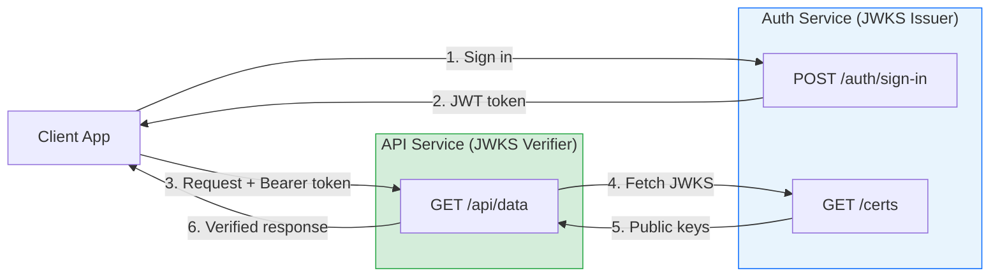
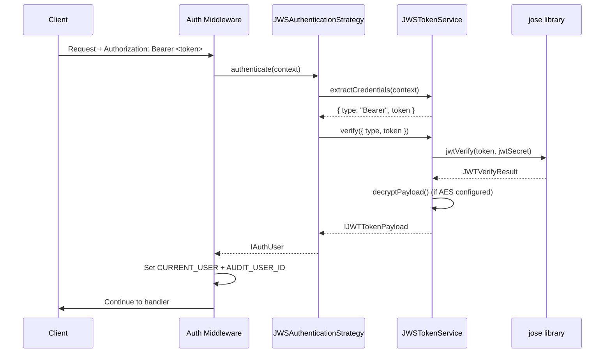
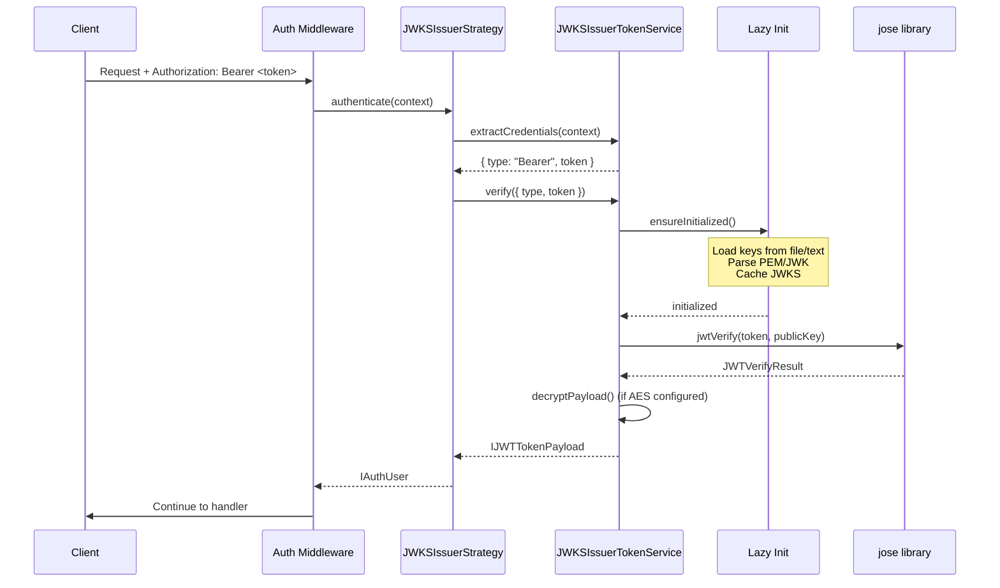
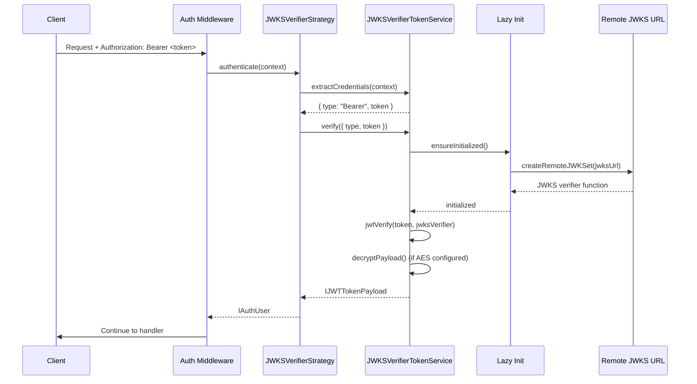
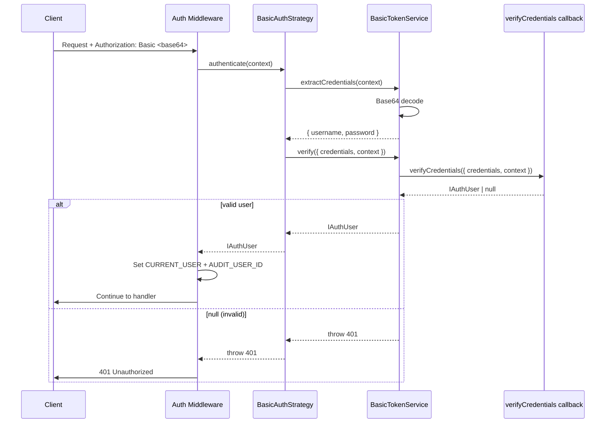
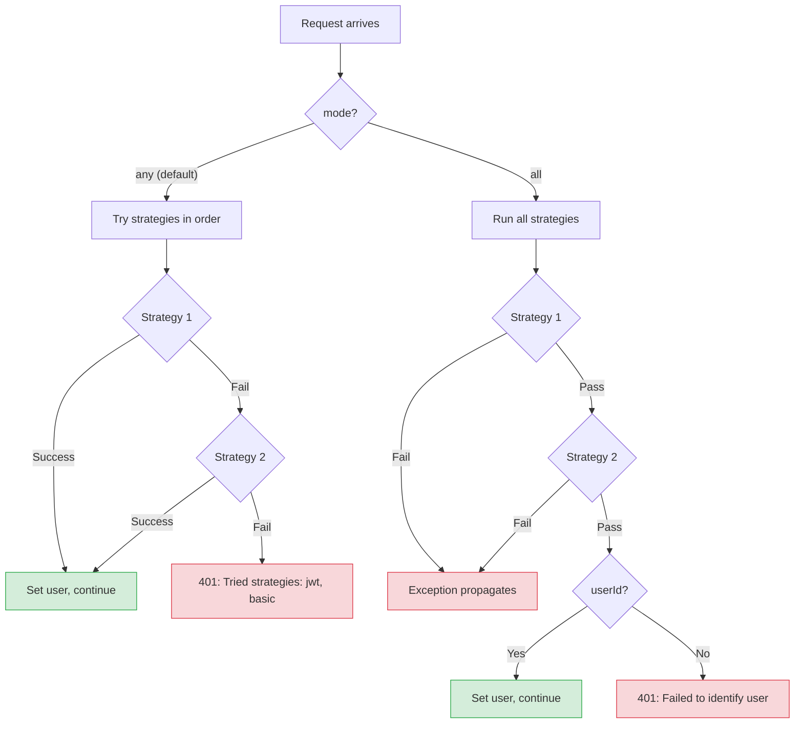
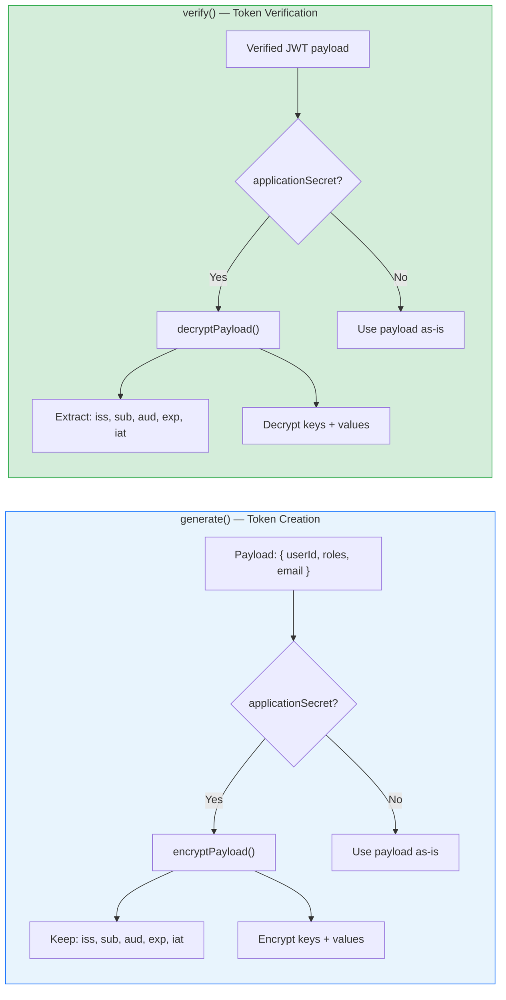

# Authentication -- Usage & Examples

> Securing routes, authentication flows, JWKS microservice patterns, entity helpers, and API endpoint specifications. See [Setup & Configuration](./) for initial setup.

## Securing Routes

Use the `authenticate` field in route configurations. The field accepts `TRouteAuthenticateConfig`:

```typescript
// Single strategy
const SECURE_ROUTE_CONFIG = {
  path: '/secure-data',
  method: HTTP.Methods.GET,
  authenticate: { strategies: [Authentication.STRATEGY_JWT] },
  responses: jsonResponse({
    description: 'Protected data',
    schema: z.object({ message: z.string() }),
  }),
} as const;

// Multiple strategies with fallback (any mode)
const FALLBACK_AUTH_CONFIG = {
  path: '/api/data',
  method: HTTP.Methods.GET,
  authenticate: {
    strategies: [Authentication.STRATEGY_JWT, Authentication.STRATEGY_BASIC],
    mode: AuthenticationModes.ANY,
  },
  responses: jsonResponse({
    description: 'Data accessible via JWT or Basic auth',
    schema: z.object({ data: z.any() }),
  }),
} as const;

// Skip authentication
const PUBLIC_ROUTE_CONFIG = {
  path: '/public',
  method: HTTP.Methods.GET,
  authenticate: { skip: true },
  responses: jsonResponse({
    description: 'Public endpoint',
    schema: z.object({ message: z.string() }),
  }),
} as const;
```

## Using the `authenticate()` Standalone Function

The `authenticate()` function creates an `AuthenticationProvider` instance and uses its middleware factory. It returns a Hono `MiddlewareHandler` suitable for direct middleware usage:

```typescript
import { authenticate, Authentication, AuthenticationModes } from '@venizia/ignis';

// Use as Hono middleware directly
const authMiddleware = authenticate({
  strategies: [Authentication.STRATEGY_JWT],
  mode: AuthenticationModes.ANY,
});

// Apply to a Hono route
app.get('/protected', authMiddleware, (c) => {
  const user = c.get(Authentication.CURRENT_USER);
  return c.json({ userId: user.userId });
});
```

## Accessing the Current User

After authentication, the user payload is available on the Hono `Context`:

```typescript
import { Context } from 'hono';
import { Authentication, IJWTTokenPayload } from '@venizia/ignis';

// Inside a route handler
const user = c.get(Authentication.CURRENT_USER) as IJWTTokenPayload | undefined;

if (user) {
  console.log('Authenticated user ID:', user.userId);
  console.log('User roles:', user.roles);
}
```

## Dynamic Skip Authentication

Use `Authentication.SKIP_AUTHENTICATION` to dynamically skip auth in middleware:

```typescript
import { Authentication } from '@venizia/ignis';
import { createMiddleware } from 'hono/factory';

const conditionalAuthMiddleware = createMiddleware(async (c, next) => {
  if (c.req.header('X-API-Key') === 'valid-api-key') {
    c.set(Authentication.SKIP_AUTHENTICATION, true);
  }
  return next();
});
```

## Implementing an AuthenticationService

The `AuthenticateComponent` depends on a service implementing the `IAuthService` interface when using the built-in auth controller.

### JWS Example

```typescript
import {
  BaseService,
  inject,
  IAuthService,
  IJWTTokenPayload,
  JWSTokenService,
  BindingKeys,
  BindingNamespaces,
  TSignInRequest,
  TContext,
} from '@venizia/ignis';
import { getError } from '@venizia/ignis-helpers';
import { Env } from 'hono';

export class AuthenticationService extends BaseService implements IAuthService {
  constructor(
    @inject({
      key: BindingKeys.build({
        namespace: BindingNamespaces.SERVICE,
        key: JWSTokenService.name,
      }),
    })
    private _tokenService: JWSTokenService,
  ) {
    super({ scope: AuthenticationService.name });
  }

  async signIn(context: TContext<Env>, opts: TSignInRequest): Promise<{ token: string }> {
    const { identifier, credential } = opts;
    const user = await this.userRepo.findByIdentifier(identifier);

    if (!user || !await this.verifyCredential(credential, user)) {
      throw getError({ message: 'Invalid credentials' });
    }

    const payload: IJWTTokenPayload = {
      userId: user.id,
      roles: user.roles,
    };

    const token = await this._tokenService.generate({ payload });
    return { token };
  }

  async signUp(context: TContext<Env>, opts: any): Promise<any> {
    // Implement your sign-up logic
  }

  async changePassword(context: TContext<Env>, opts: any): Promise<any> {
    // Implement your change password logic
  }
}
```

### JWKS Issuer Example

```typescript
import {
  BaseService,
  inject,
  IAuthService,
  IJWTTokenPayload,
  JWKSIssuerTokenService,
  BindingKeys,
  BindingNamespaces,
  TSignInRequest,
  TContext,
} from '@venizia/ignis';
import { getError } from '@venizia/ignis-helpers';
import { Env } from 'hono';

export class AuthenticationService extends BaseService implements IAuthService {
  constructor(
    @inject({
      key: BindingKeys.build({
        namespace: BindingNamespaces.SERVICE,
        key: JWKSIssuerTokenService.name,
      }),
    })
    private _tokenService: JWKSIssuerTokenService,
  ) {
    super({ scope: AuthenticationService.name });
  }

  async signIn(context: TContext<Env>, opts: TSignInRequest): Promise<{ token: string }> {
    const { identifier, credential } = opts;
    // ... lookup and verify user ...

    const payload: IJWTTokenPayload = {
      userId: user.id,
      roles: user.roles,
    };

    const token = await this._tokenService.generate({ payload });
    return { token };
  }

  // ... signUp, changePassword ...
}
```

## JWKS Microservice Patterns

### Issuer + Verifier Architecture

In a microservice architecture, one service issues tokens (issuer) and other services verify them (verifier):



**Auth Service (Issuer):**
```typescript
this.bind<TJWTTokenServiceOptions>({ key: AuthenticateBindingKeys.JWT_OPTIONS }).toValue({
  standard: JOSEStandards.JWKS,
  options: {
    mode: JWKSModes.ISSUER,
    algorithm: 'ES256',
    keys: {
      driver: JWKSKeyDrivers.FILE,
      format: JWKSKeyFormats.PEM,
      private: './keys/private.pem',
      public: './keys/public.pem',
    },
    kid: 'auth-key-1',
    getTokenExpiresFn: () => 86400,
  },
});
```

**API Service (Verifier):**
```typescript
this.bind<TJWTTokenServiceOptions>({ key: AuthenticateBindingKeys.JWT_OPTIONS }).toValue({
  standard: JOSEStandards.JWKS,
  options: {
    mode: JWKSModes.VERIFIER,
    jwksUrl: 'https://auth-service.internal/certs',
    cacheTtlMs: 43_200_000,  // Cache for 12 hours
    cooldownMs: 30_000,       // Min 30s between refreshes
  },
});
```

### JWKS with AES Payload Encryption

When using AES payload encryption across services, **both issuer and verifier must share the same `applicationSecret`**:

**Issuer:**
```typescript
{
  mode: JWKSModes.ISSUER,
  algorithm: 'ES256',
  keys: { /* ... */ },
  kid: 'auth-key-1',
  getTokenExpiresFn: () => 86400,
  applicationSecret: process.env.APP_ENV_APPLICATION_SECRET,
}
```

**Verifier:**
```typescript
{
  mode: JWKSModes.VERIFIER,
  jwksUrl: 'https://auth-service.internal/certs',
  applicationSecret: process.env.APP_ENV_APPLICATION_SECRET, // Must match issuer
}
```

### JWKS Key Generation

Generate ES256 keys for JWKS:

```bash
# Generate private key
openssl ecparam -genkey -name prime256v1 -noout -out private.pem

# Generate public key from private key
openssl ec -in private.pem -pubout -out public.pem
```

Generate RS256 keys:

```bash
# Generate private key
openssl genrsa -out private.pem 2048

# Generate public key from private key
openssl rsa -in private.pem -pubout -out public.pem
```

> [!WARNING]
> Never commit private keys to version control. The `.gitignore` includes patterns for `*.pem`, `*.key`, and `keys/` directories.

### Inline Keys (Text Driver)

For environments where file access is restricted (e.g., serverless), use the `text` driver:

```typescript
{
  mode: JWKSModes.ISSUER,
  algorithm: 'ES256',
  keys: {
    driver: JWKSKeyDrivers.TEXT,
    format: JWKSKeyFormats.PEM,
    private: process.env.JWKS_PRIVATE_KEY!, // PEM string from env
    public: process.env.JWKS_PUBLIC_KEY!,   // PEM string from env
  },
  kid: 'auth-key-1',
  getTokenExpiresFn: () => 86400,
}
```

## Entity Column Helpers

The authentication module provides a set of **column helper functions** designed to be spread into Drizzle `pgTable()` definitions. These functions return pre-configured column objects for common auth-related entities, saving you from manually defining columns for users, roles, permissions, and their relationships.

### Pattern

Each helper function returns an object of Drizzle column builders that you spread into your `pgTable()` call alongside any custom columns:

```typescript
import { pgTable, serial, text } from 'drizzle-orm/pg-core';
import {
  extraUserColumns,
  extraRoleColumns,
  extraPermissionColumns,
  extraPermissionMappingColumns,
  extraUserRoleColumns,
} from '@venizia/ignis';
import { withSerialId, withTimestamps } from '@venizia/ignis';

// User table with auth columns
export const users = pgTable('users', {
  ...withSerialId(),
  ...withTimestamps(),
  ...extraUserColumns(),
  username: text('username').unique().notNull(),
  passwordHash: text('password_hash').notNull(),
  email: text('email').unique(),
});

// Role table with auth columns
export const roles = pgTable('roles', {
  ...withSerialId(),
  ...withTimestamps(),
  ...extraRoleColumns(),
});

// Permission table
export const permissions = pgTable('permissions', {
  ...withSerialId(),
  ...withTimestamps(),
  ...extraPermissionColumns(),
});

// Permission mapping (role-to-permission or user-to-permission)
export const permissionMappings = pgTable('permission_mappings', {
  ...withSerialId(),
  ...extraPermissionMappingColumns(),
});

// User-role junction table
export const userRoles = pgTable('user_roles', {
  ...withSerialId(),
  ...extraUserRoleColumns(),
});
```

### extraUserColumns

Returns columns for user-related fields with status and type defaults from `UserStatuses` and `UserTypes`.

```typescript
extraUserColumns(opts?: { idType: 'string' | 'number' })
```

| Column | Type | Default | Description |
|--------|------|---------|-------------|
| `realm` | `text` | `''` | Multi-tenancy realm identifier |
| `status` | `text` | `UserStatuses.UNKNOWN` (`'000_UNKNOWN'`) | User status |
| `type` | `text` | `UserTypes.SYSTEM` (`'SYSTEM'`) | User type |
| `activatedAt` | `timestamp (tz)` | `null` | Activation timestamp |
| `lastLoginAt` | `timestamp (tz)` | `null` | Last login timestamp |
| `parentId` | `text` or `integer` | `null` | Parent user ID (type depends on `idType`) |

### extraRoleColumns

Returns columns for role definitions. No options parameter.

```typescript
extraRoleColumns()
```

| Column | Type | Default | Description |
|--------|------|---------|-------------|
| `identifier` | `text` | -- | Unique role identifier (e.g., `'admin'`, `'user'`) |
| `name` | `text` | -- | Human-readable role name |
| `description` | `text` | `null` | Optional role description |
| `priority` | `integer` | -- | Role priority (lower = higher priority) |
| `status` | `text` | `RoleStatuses.ACTIVATED` (`'201_ACTIVATED'`) | Role status |

### extraPermissionColumns

Returns columns for permission definitions. Supports `idType` option for the `parentId` column type.

```typescript
extraPermissionColumns(opts?: { idType: 'string' | 'number' })
```

| Column | Type | Default | Description |
|--------|------|---------|-------------|
| `code` | `text` | -- | Unique permission code |
| `name` | `text` | -- | Permission name |
| `subject` | `text` | -- | Permission subject (e.g., `'User'`, `'Order'`) |
| `pType` | `text` | -- | Permission type (maps to DB column `p_type`) |
| `action` | `text` | -- | Permitted action (e.g., `'read'`, `'write'`) |
| `scope` | `text` | -- | Permission scope |
| `parentId` | `text` or `integer` | `null` | Parent permission ID |

### extraPermissionMappingColumns

Returns columns for mapping permissions to users or roles.

```typescript
extraPermissionMappingColumns(opts?: { idType: 'string' | 'number' })
```

| Column | Type | Default | Description |
|--------|------|---------|-------------|
| `effect` | `text` | `null` | Permission effect (e.g., `'allow'`, `'deny'`) |
| `userId` | `text` or `integer` | `null` | Associated user ID |
| `roleId` | `text` or `integer` | `null` | Associated role ID |
| `permissionId` | `text` or `integer` | -- | Associated permission ID (not null) |

### extraUserRoleColumns

Returns columns for the user-role junction table. Includes principal columns (polymorphic type/ID fields) via `generatePrincipalColumnDefs` with a default polymorphic value of `'Role'`.

```typescript
extraUserRoleColumns(opts?: { idType: 'string' | 'number' })
```

| Column | Type | Default | Description |
|--------|------|---------|-------------|
| _(principal columns)_ | _various_ | -- | Polymorphic columns from `generatePrincipalColumnDefs` |
| `userId` | `text` or `integer` | -- | Associated user ID (not null) |

### ID Type Polymorphism

All column helpers that accept `opts.idType` default to `'number'` (producing `integer` columns). Pass `'string'` to use `text` columns instead:

```typescript
// Number IDs (default) -- uses integer columns for FK references
extraUserColumns()
extraPermissionColumns()

// String IDs (e.g., UUID) -- uses text columns for FK references
extraUserColumns({ idType: 'string' })
extraPermissionColumns({ idType: 'string' })
```

## Status Constants

The authentication module uses status classes from `@/common/statuses`. These extend `CommonStatuses` and provide lifecycle state management for auth entities.

### UserStatuses

Inherits all statuses from `CommonStatuses`:

| Constant | Value | Description |
|----------|-------|-------------|
| `UserStatuses.UNKNOWN` | `'000_UNKNOWN'` | Initial/unverified state |
| `UserStatuses.ACTIVATED` | `'201_ACTIVATED'` | Active user |
| `UserStatuses.DEACTIVATED` | `'401_DEACTIVATED'` | Deactivated user |
| `UserStatuses.BLOCKED` | `'403_BLOCKED'` | Blocked user |
| `UserStatuses.ARCHIVED` | `'405_ARCHIVED'` | Archived user |

### UserTypes

| Constant | Value | Description |
|----------|-------|-------------|
| `UserTypes.SYSTEM` | `'SYSTEM'` | System-created user (default) |
| `UserTypes.LINKED` | `'LINKED'` | Linked/external user |

### RoleStatuses

Inherits all statuses from `CommonStatuses` (same values as `UserStatuses`):

| Constant | Value | Description |
|----------|-------|-------------|
| `RoleStatuses.UNKNOWN` | `'000_UNKNOWN'` | Initial state |
| `RoleStatuses.ACTIVATED` | `'201_ACTIVATED'` | Active role (default for `extraRoleColumns`) |
| `RoleStatuses.DEACTIVATED` | `'401_DEACTIVATED'` | Deactivated role |
| `RoleStatuses.BLOCKED` | `'403_BLOCKED'` | Blocked role |
| `RoleStatuses.ARCHIVED` | `'405_ARCHIVED'` | Archived role |

## Auth Flows

### JWS Authentication Flow



1. **Client sends request** with <code v-pre>Authorization: Bearer &lt;token&gt;</code> header
2. **JWSAuthenticationStrategy.authenticate()** is called by the Hono middleware
3. **AbstractBearerTokenService.extractCredentials()** extracts the token from the Authorization header
4. **JWSTokenService.doVerify()** verifies the JWT signature using `jose.jwtVerify()` with the shared `jwtSecret`
5. **AbstractBearerTokenService.decryptPayload()** decrypts the AES-encrypted payload fields (if AES configured)
6. **User payload is set** on `context.get(Authentication.CURRENT_USER)`

### JWKS Issuer Authentication Flow



1. **Client sends request** with <code v-pre>Authorization: Bearer &lt;token&gt;</code> header
2. **JWKSIssuerAuthenticationStrategy.authenticate()** is called by the Hono middleware
3. **AbstractBearerTokenService.extractCredentials()** extracts the token from the Authorization header
4. **JWKSIssuerTokenService.doVerify()** calls `ensureInitialized()` (lazy-loads keys on first call), then verifies the JWT using the public key
5. **AbstractBearerTokenService.decryptPayload()** decrypts the AES-encrypted payload fields (if AES configured)
6. **User payload is set** on `context.get(Authentication.CURRENT_USER)`

### JWKS Verifier Authentication Flow



1. **Client sends request** with <code v-pre>Authorization: Bearer &lt;token&gt;</code> header
2. **JWKSVerifierAuthenticationStrategy.authenticate()** is called by the Hono middleware
3. **AbstractBearerTokenService.extractCredentials()** extracts the token from the Authorization header
4. **JWKSVerifierTokenService.doVerify()** calls `ensureInitialized()` (creates remote JWKS verifier on first call), then verifies the JWT using the remote JWKS
5. **AbstractBearerTokenService.decryptPayload()** decrypts the AES-encrypted payload fields (if AES configured)
6. **User payload is set** on `context.get(Authentication.CURRENT_USER)`

### Basic Authentication Flow



1. **Client sends request** with <code v-pre>Authorization: Basic &lt;base64(username:password)&gt;</code> header
2. **BasicAuthenticationStrategy.authenticate()** is called by the Hono middleware
3. **BasicTokenService.extractCredentials()** decodes the Base64 credentials
4. **BasicTokenService.verify()** calls the user-provided `verifyCredentials` callback with `{ credentials, context }`
5. **User payload is set** on `context.get(Authentication.CURRENT_USER)` if verification succeeds

> [!IMPORTANT]
> The `verifyCredentials` callback must perform all necessary validation (password hashing comparison, user lookup, etc.) and return an `IAuthUser` object or `null`.

## Multi-Strategy Authentication

When multiple strategies are configured on a route via `authenticate: { strategies: ['jwt', 'basic'] }`:



**`any` mode (default):**
- Strategies are tried in the order specified
- The first successful strategy wins
- Errors from failing strategies are **discarded** (logged at debug level)
- If all strategies fail, a `401 Unauthorized` error is thrown listing all tried strategies
- **Use case:** Fallback authentication (try JWT, fallback to Basic)

**`all` mode:**
- Every strategy must pass successfully
- If any strategy fails, the request is immediately rejected (exception propagates)
- The last strategy's user payload is used
- **Use case:** Multi-factor authentication (both JWT and Basic required)

> [!TIP]
> Use `'any'` mode for graceful fallback (e.g., allow mobile apps to use JWT while legacy systems use Basic). Use `'all'` mode for high-security endpoints requiring multiple forms of authentication.

## Token Encryption (Optional AES)



JWT payloads can optionally be encrypted field-by-field using AES (default `aes-256-cbc`) via the `@venizia/ignis-helpers` AES utility. This is configured by providing `applicationSecret` in the service options.

> [!NOTE]
> AES payload encryption is **optional** for all JOSE standards (JWS and JWKS). When `applicationSecret` is not provided, payloads are stored in standard plaintext JWT format.

**Encryption process (when `applicationSecret` is provided):**
1. Standard JWT fields (`iss`, `sub`, `aud`, `jti`, `nbf`, `exp`, `iat`) are preserved as-is
2. All other fields have both their **keys** and **values** AES-encrypted
3. The `roles` field is serialized as `id|identifier|priority` pipe-separated strings before encryption
4. `null` and `undefined` values are skipped during encryption

**Decryption process:**
1. If AES is not configured (`this.aes` is null), the payload is returned as-is
2. Standard JWT fields are extracted directly
3. Encrypted fields have their keys decrypted first, then their values
4. The `roles` field is deserialized: JSON-parsed to a string array, then each entry is split on `|` to reconstruct objects with `id`, `identifier`, and `priority` (where `priority` is converted to integer via `int()`)

> [!WARNING]
> The `applicationSecret` must remain constant across all instances of your application. Changing it will invalidate all existing tokens, as they cannot be decrypted with a different secret. In JWKS microservice setups, the issuer and all verifiers must share the same `applicationSecret`.

## Hono Context Extension

The Authentication module extends Hono's `ContextVariableMap` to provide type-safe access to auth data. Note: `ContextVariableMap` does **not** take a generic parameter — it is a plain interface augmentation:

```typescript
declare module 'hono' {
  interface ContextVariableMap {
    [Authentication.CURRENT_USER]: IAuthUser;
    [Authentication.AUDIT_USER_ID]: IdType;
  }
}
```

This enables type-safe access in route handlers:

```typescript
// TypeScript knows this is IAuthUser
const user = c.get(Authentication.CURRENT_USER);
```

**Context variable keys (from `Authentication` constants):**

| Key | Constant | Type | Description |
|-----|----------|------|-------------|
| `'auth.current.user'` | `Authentication.CURRENT_USER` | `IAuthUser` | The authenticated user payload |
| `'audit.user.id'` | `Authentication.AUDIT_USER_ID` | `IdType` | The authenticated user's ID (extracted from `userId`) |
| `'authentication.skip'` | `Authentication.SKIP_AUTHENTICATION` | `boolean` | Set to `true` to bypass authentication on a request |

## Request Schemas

### SignInRequestSchema

The built-in schema uses a nested `identifier` + `credential` structure:

```typescript
const SignInRequestSchema = z.object({
  identifier: z.object({
    scheme: requiredString({ min: 4 }),  // e.g., 'username', 'email'
    value: requiredString({ min: 8 }),   // the actual identifier value
  }),
  credential: z.object({
    scheme: requiredString(),             // e.g., 'basic', 'password'
    value: requiredString({ min: 8 }),   // the actual credential value
  }),
  clientId: z.string().optional(),        // optional auth provider
});

type TSignInRequest = z.infer<typeof SignInRequestSchema>;
```

### SignUpRequestSchema

The built-in schema uses a **flat structure**:

```typescript
const SignUpRequestSchema = z.object({
  username: z.string().nonempty().min(8),
  credential: z.string().nonempty().min(8),
});

type TSignUpRequest = z.infer<typeof SignUpRequestSchema>;
```

### ChangePasswordRequestSchema

```typescript
const ChangePasswordRequestSchema = z.object({
  scheme: z.string(),
  oldCredential: requiredString({ min: 8 }),
  newCredential: requiredString({ min: 8 }),
  userId: z.string().or(z.number()),
});

type TChangePasswordRequest = z.infer<typeof ChangePasswordRequestSchema>;
```

### JWTTokenPayloadSchema

Exported from the controller factory module. Used as the response schema for the `/who-am-i` endpoint:

```typescript
const JWTTokenPayloadSchema = z.object({
  userId: z.string().or(z.number()),
  roles: z.array(
    z.object({
      id: z.string().or(z.number()),
      identifier: z.string(),
      priority: z.number().int(),
    }),
  ),
  clientId: z.string().optional(),
  provider: z.string().optional(),
  email: z.email().optional(),
});
```

## API Endpoints

The built-in auth controller is created by the `defineAuthController()` factory function and is only available when `useAuthController: true` is set in `REST_OPTIONS`.

| Method | Path | Auth Required | Description |
|--------|------|---------------|-------------|
| `POST` | `/auth/sign-in` | No | Authenticate and receive a JWT token |
| `POST` | `/auth/sign-up` | Configurable | Create a new user account |
| `POST` | `/auth/change-password` | JWT | Change the authenticated user's password |
| `GET` | `/auth/who-am-i` | JWT | Return the current user's JWT payload |
| `GET` | `/certs` | No | JWKS endpoint (JWKS Issuer mode only) |

> [!NOTE]
> The base path `/auth` is configurable via `controllerOpts.restPath`. The `/certs` path is configurable via `rest.path` in `IJWKSIssuerOptions`. The `/certs` endpoint is intentionally unauthenticated — it serves the public keys needed by external verifiers.

### POST /auth/sign-in

**Authentication:** None

**Request Body:**

Uses `SignInRequestSchema` by default, or a custom schema via `payload.signIn.request.schema`.

**Response 200:**

Uses `payload.signIn.response.schema` if provided, otherwise `AnyObjectSchema`.

```json
{
  "token": "eyJhbGciOiJFUzI1NiIsImtpZCI6Im15LWtleS1pZC0xIn0..."
}
```

### POST /auth/sign-up

**Authentication:** Configurable via `requireAuthenticatedSignUp` (default: `false`)

When `requireAuthenticatedSignUp: true`, requires JWT authentication. When `false`, the endpoint is public.

### POST /auth/change-password

**Authentication:** Always requires JWT (`Authentication.STRATEGY_JWT`)

### GET /auth/who-am-i

**Authentication:** Always requires JWT (`Authentication.STRATEGY_JWT`)

Returns the current user's decrypted JWT payload directly from context.

```json
{
  "userId": "123",
  "roles": [
    { "id": "1", "identifier": "admin", "priority": 0 }
  ],
  "clientId": "optional-client-id",
  "provider": "optional-provider",
  "email": "user@example.com"
}
```

### GET /certs (JWKS Issuer Only)

**Authentication:** None (intentionally public)

Returns the JSON Web Key Set for external verifiers.

```json
{
  "keys": [
    {
      "kty": "EC",
      "kid": "my-key-id-1",
      "use": "sig",
      "alg": "ES256",
      "crv": "P-256",
      "x": "...",
      "y": "..."
    }
  ]
}
```

**Cache headers:** `Cache-Control: public, max-age=3600, stale-while-revalidate=86400`

## See Also

- [Setup & Configuration](./) -- Binding keys, options interfaces, and initial setup
- [API Reference](./api) -- Architecture, service internals, and strategy registry
- [Error Reference](./errors) -- Error messages and troubleshooting
