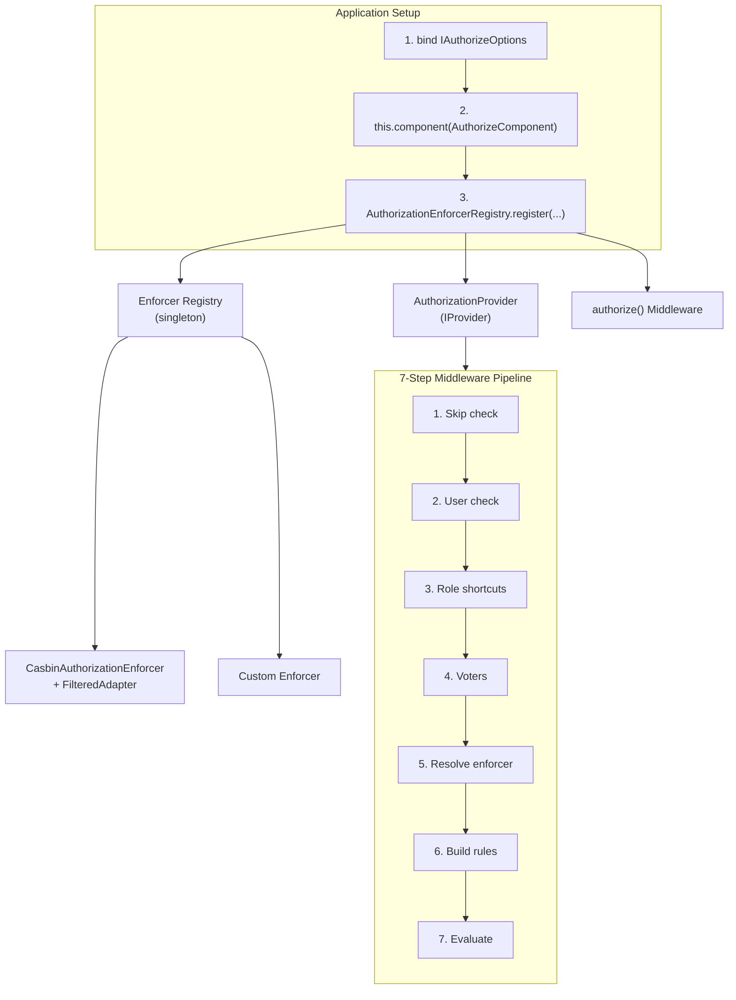
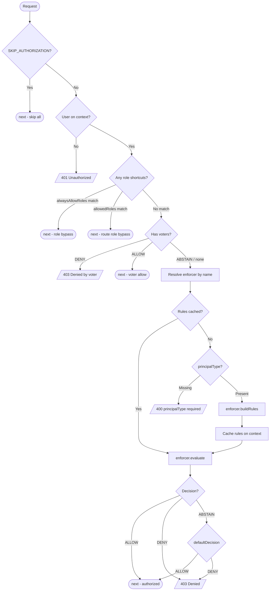
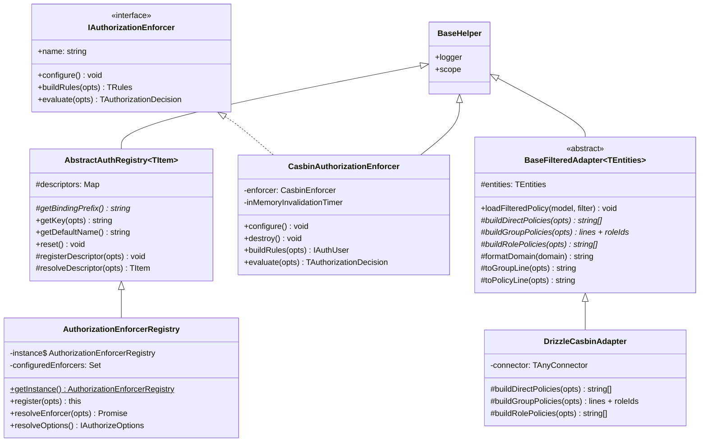
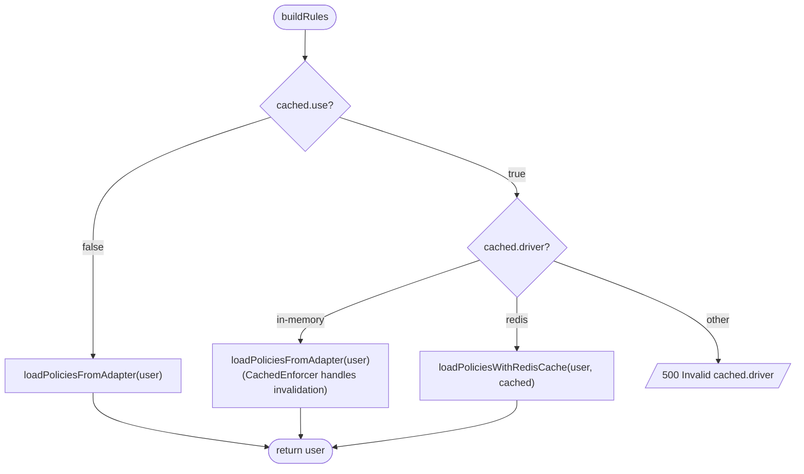
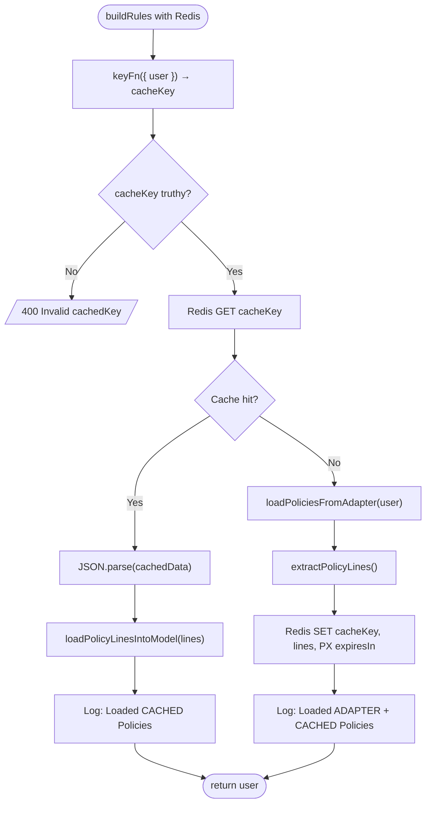
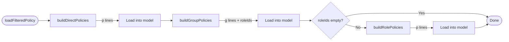

# Authorization -- API Reference

> Architecture, enforcer internals, provider, registry, adapters, models, and middleware pipeline. See [Setup & Configuration](./) for initial setup.

## Architecture

### System Overview



### Middleware Pipeline Flowchart



### Class Hierarchy



### Module File Layout

```
auth/authorize/
├── adapters/
│   ├── base-filtered.ts          # BaseFilteredAdapter (abstract template)
│   └── drizzle-casbin.ts         # DrizzleCasbinAdapter (concrete SQL)
├── common/
│   ├── constants.ts              # Authorization, AuthorizationActions, AuthorizationDecisions,
│   │                             #   AuthorizationRoles, AuthorizationEnforcerTypes,
│   │                             #   CasbinEnforcerCachedDrivers, CasbinEnforcerModelDrivers,
│   │                             #   CasbinRuleVariants
│   ├── keys.ts                   # AuthorizeBindingKeys
│   ├── types.ts                  # IAuthorizeOptions, IAuthorizationEnforcer,
│   │                             #   IAuthorizationSpec, ICasbinEnforcerOptions, etc.
│   └── index.ts                  # Barrel export
├── enforcers/
│   ├── casbin.enforcer.ts        # CasbinAuthorizationEnforcer
│   ├── enforcer-registry.ts      # AuthorizationEnforcerRegistry (singleton)
│   └── index.ts                  # Barrel export
├── middlewares/
│   └── authorize.middleware.ts   # authorize() standalone function
├── models/
│   ├── abilities/
│   │   ├── string-action.model.ts    # StringAuthorizationAction
│   │   ├── string-resource.model.ts  # StringAuthorizationResource
│   │   └── index.ts
│   ├── authorization-role.model.ts   # AuthorizationRole
│   └── index.ts
├── providers/
│   └── authorization.provider.ts # AuthorizationProvider
├── component.ts                  # AuthorizeComponent
└── index.ts                      # Barrel export (all submodules)
```

### Tech Stack

| Technology | Purpose |
|------------|---------|
| **Hono middleware** | Route-level authorization via `createMiddleware` from `hono/factory` |
| **`casbin`** (optional) | External policy engine for Casbin enforcer. Peer dependency -- not bundled. |
| **`@venizia/ignis-helpers`** | `BaseHelper` base class, `getError` for error creation, `HTTP` result codes |
| **`@venizia/ignis-inversion`** | `IProvider` interface, `BindingScopes` for singleton registration |

### Design Decisions

| Decision | Rationale |
|----------|-----------|
| **Enforcer-based** | Pluggable architecture -- swap between Casbin and custom enforcers without changing route configs |
| **Registry + co-located options** | Enforcer class, name, type, and options are registered together -- no split configuration across two binding sites |
| **Type-discriminated enforcers** | `type: 'casbin' \| 'custom'` in registry for type-safe options (`ICasbinEnforcerOptions` vs `unknown`) |
| **Voter pattern** | Custom logic that short-circuits before the enforcer (Spring Security inspiration) |
| **Rules caching** | Built rules cached on Hono context per-request -- avoids rebuilding for multi-spec routes |
| **Registry singleton** | Mirrors `AuthenticationStrategyRegistry` pattern -- consistent with the codebase |
| **Abstract base** | `AbstractAuthRegistry<T>` shared between authentication and authorization registries |
| **Filtered adapter pattern** | `BaseFilteredAdapter` template method pattern allows custom query backends while sharing formatting logic |
| **IAuthorizationComparable** | Generic comparison interface for custom action/resource types beyond plain strings |

## Component Lifecycle

The `AuthorizeComponent` extends `BaseComponent` and executes during its `binding()` method:

| Step | Action | Failure |
|------|--------|---------|
| 1 | Resolve `IAuthorizeOptions` from container via `AuthorizeBindingKeys.OPTIONS` | Throws `[AuthorizeComponent] No authorize options found` |
| 2 | Call `bindAlwaysAllowRoles()` -- binds `alwaysAllowRoles` to `AuthorizeBindingKeys.ALWAYS_ALLOW_ROLES` if present | -- (skipped if no roles) |

```typescript
class AuthorizeComponent extends BaseComponent {
  constructor(
    @inject({ key: CoreBindings.APPLICATION_INSTANCE }) private application: BaseApplication,
  ) { ... }

  override binding(): ValueOrPromise<void>;
  private bindAlwaysAllowRoles(opts: { options: IAuthorizeOptions }): void;
}
```

> [!NOTE]
> The component's role is minimal -- it validates that global options exist and binds `alwaysAllowRoles` for consumer access. Enforcer registration happens separately via `AuthorizationEnforcerRegistry.register()`.

## AbstractAuthRegistry

Shared base class for both authentication and authorization registries. Provides descriptor storage, binding key generation, and DI resolution.

### TRegistryDescriptor

```typescript
type TRegistryDescriptor<TItem> = {
  container: Container;
  targetClass: TClass<TItem>;
};
```

### Class

```typescript
abstract class AbstractAuthRegistry<TItem> extends BaseHelper {
  protected descriptors: Map<string, TRegistryDescriptor<TItem>>;

  constructor(opts: { scope: string });

  // Abstract -- subclass provides the binding key prefix
  protected abstract getBindingPrefix(): string;

  // Public API
  getKey(opts: { name: string }): string;
  getDefaultName(): string;
  reset(): void;

  // Protected internals
  protected registerDescriptor(opts: { container: Container; target: TClass<TItem>; name: string }): void;
  protected resolveDescriptor(opts: { name: string }): TItem;
}
```

### Methods

| Method | Description | Throws |
|--------|-------------|--------|
| `getKey({ name })` | Builds binding key as `{prefix}.{name}` | `[getKey] Invalid name` if name is empty |
| `getDefaultName()` | Returns the first registered descriptor's name (Map insertion order) | `[ClassName] No items registered` if none |
| `registerDescriptor(opts)` | Stores `TRegistryDescriptor` in Map + binds class as `SINGLETON` in DI container | -- |
| `resolveDescriptor({ name })` | Resolves instance from DI container by key | `Descriptor not found: {name}` or `Failed to resolve: {name}` |
| `reset()` | Clears all descriptors from the Map | -- |

### Subclass Binding Prefixes

| Registry | `getBindingPrefix()` returns |
|----------|------------------------------|
| `AuthenticationStrategyRegistry` | `Authentication.STRATEGY` |
| `AuthorizationEnforcerRegistry` | `Authorization.ENFORCER` (`'authorization.enforcer'`) |

## Enforcer Registry

<code v-pre>AuthorizationEnforcerRegistry</code> is a **singleton** that manages registered enforcers. It extends `AbstractAuthRegistry<IAuthorizationEnforcer>`.

### Class Hierarchy

```
BaseHelper
  └── AbstractAuthRegistry<TItem>
        ├── AuthenticationStrategyRegistry  (authenticate)
        └── AuthorizationEnforcerRegistry   (authorize)
```

### Class

```typescript
class AuthorizationEnforcerRegistry extends AbstractAuthRegistry<IAuthorizationEnforcer> {
  private static instance: AuthorizationEnforcerRegistry;
  private configuredEnforcers: Set<string>;

  static getInstance(): AuthorizationEnforcerRegistry;
  override reset(): void;   // clears descriptors + configuredEnforcers

  protected getBindingPrefix(): string;  // returns Authorization.ENFORCER

  register(opts: { ... }): this;
  getDefaultEnforcerName(): string;
  resolveEnforcer(opts: { name: string }): Promise<IAuthorizationEnforcer>;
  resolveOptions(): IAuthorizeOptions | undefined;
}
```

### API

| Method | Returns | Description |
|--------|---------|-------------|
| `getInstance()` | `AuthorizationEnforcerRegistry` | Returns the singleton instance (creates on first call) |
| `register(opts)` | `this` | Registers enforcers with type-safe options. See below. |
| `getDefaultEnforcerName()` | `string` | Delegates to `getDefaultName()` -- returns the first registered enforcer's name |
| `resolveEnforcer({ name })` | `Promise<IAuthorizationEnforcer>` | Resolves and auto-configures an enforcer (configure-once pattern via `configuredEnforcers` Set) |
| `resolveOptions()` | `IAuthorizeOptions \| undefined` | Iterates all registered containers looking for `AuthorizeBindingKeys.OPTIONS` |
| `reset()` | `void` | Clears all descriptors AND the `configuredEnforcers` set |

### register()

The `register` method accepts a discriminated union of enforcer descriptors:

```typescript
register(opts: {
  container: Container;
  enforcers: Array<
    | {
        enforcer: TClass<IAuthorizationEnforcer>;
        name: string;
        type: 'casbin';
        options?: ICasbinEnforcerOptions;
      }
    | {
        enforcer: TClass<IAuthorizationEnforcer>;
        name: string;
        type: 'custom';
        options?: unknown;
      }
  >;
}) => this
```

**Behavior:**
1. Validates no duplicate names in the batch (across all `enforcers` in this call)
2. Validates each name is not already registered (against previously registered enforcers)
3. Calls `registerDescriptor()` -- binds each enforcer class as singleton: `authorization.enforcer.{name}`
4. If `options` is provided, binds it to `AuthorizeBindingKeys.enforcerOptions(name)` (`@app/authorize/enforcers/{name}/options`)

> [!NOTE]
> `register()` returns `this`, enabling method chaining. The `type` field provides TypeScript-level type safety for the `options` field -- `type: 'casbin'` constrains `options` to `ICasbinEnforcerOptions`, while `type: 'custom'` allows `unknown`.

### Configure-Once Pattern

The `resolveEnforcer()` method tracks which enforcers have been configured via the `configuredEnforcers: Set<string>`:

```typescript
async resolveEnforcer(opts: { name: string }): Promise<IAuthorizationEnforcer> {
  const enforcer = this.resolveDescriptor(opts);  // from AbstractAuthRegistry

  if (!this.configuredEnforcers.has(opts.name)) {
    await enforcer.configure();
    this.configuredEnforcers.add(opts.name);
  }

  return enforcer;
}
```

First call: resolves + calls `configure()`. Subsequent calls: resolves only.

## IAuthorizationEnforcer Interface

The core enforcer contract. All enforcers (Casbin, custom) must implement this interface.

```typescript
interface IAuthorizationEnforcer<
  E extends Env = Env,
  TAction = string,
  TResource = string,
  TRules = unknown,
  TBuildRulesReturn = ValueOrPromise<TRules>,
  TEvaluateReturn = ValueOrPromise<TAuthorizationDecision>,
> {
  name: string;

  configure(): ValueOrPromise<void>;

  buildRules(opts: {
    user: { principalType: string } & IAuthUser;
    context: TContext<E, string>;
  }): TBuildRulesReturn;

  evaluate(opts: {
    rules: TRules;
    request: IAuthorizationRequest<TAction, TResource>;
    context: TContext<E, string>;
  }): TEvaluateReturn;
}
```

### Generic Parameters

| Parameter | Default | Description |
|-----------|---------|-------------|
| `E` | `Env` | Hono `Env` type for typed context access |
| `TAction` | `string` | Action type. Can be `string` or `IAuthorizationComparable` for custom comparison |
| `TResource` | `string` | Resource type. Can be `string` or `IAuthorizationComparable` for custom comparison |
| `TRules` | `unknown` | Rules type produced by `buildRules` and consumed by `evaluate` |
| `TBuildRulesReturn` | `ValueOrPromise<TRules>` | Return type of `buildRules` |
| `TEvaluateReturn` | `ValueOrPromise<TAuthorizationDecision>` | Return type of `evaluate` |

### TRules per Enforcer

| Enforcer | TRules | Description |
|----------|--------|-------------|
| `CasbinAuthorizationEnforcer` | `IAuthUser` | User object (Casbin evaluates internally from loaded model) |
| Custom | Any type | Your custom rules structure |

### Method Contracts

| Method | Input | Returns | Called by |
|--------|-------|---------|----------|
| `configure()` | None | `void` | Registry on first `resolveEnforcer()` |
| `buildRules` | `{ user, context }` | `TRules` | Provider at step 6 |
| `evaluate` | `{ rules, request, context }` | `TAuthorizationDecision` | Provider at step 7 |

## IAuthorizationRequest Interface

The request object passed to `evaluate()`:

```typescript
interface IAuthorizationRequest<TAction = string, TResource = string> {
  action: TAction;
  resource: TResource;
  conditions?: TAuthorizationConditions;
}
```

| Field | Type | Description |
|-------|------|-------------|
| `action` | `TAction` | Action being checked (e.g., `'read'`, `'create'`) |
| `resource` | `TResource` | Resource being accessed (e.g., `'Article'`) |
| `conditions` | `TAuthorizationConditions` | Optional key-value conditions for ABAC |

## IAuthorizationComparable Interface

Generic comparison interface for custom action and resource types. Allows enforcers to work with objects that define their own comparison logic rather than plain strings.

```typescript
interface IAuthorizationComparable<TElement = string, TCompareResult = number> {
  value: TElement;
  compare(other: TElement): TCompareResult;
  isEqual(other: TElement): boolean;
}
```

| Member | Type | Description |
|--------|------|-------------|
| `value` | `TElement` | The underlying value |
| `compare(other)` | `TCompareResult` | Compare with another value. Convention: `0` means equal. |
| `isEqual(other)` | `boolean` | Convenience check -- typically `compare(other) === 0` |

The `CasbinAuthorizationEnforcer` constrains its `TAction` and `TResource` generics to `string | IAuthorizationComparable`, allowing either plain strings or comparable objects.

## StringAuthorizationAction

`IAuthorizationComparable` implementation for string-based actions with wildcard support.

```typescript
class StringAuthorizationAction implements IAuthorizationComparable<string> {
  static readonly WILDCARD = '*';

  readonly value: string;

  static build(opts: { value: string }): StringAuthorizationAction;
  constructor(opts: { value: string });

  compare(other: string): number;
  isEqual(other: string): boolean;
}
```

### Comparison Logic

- If `this.value === '*'` (WILDCARD), `compare()` returns `0` (matches everything)
- Otherwise, `this.value.localeCompare(other)` is used

```typescript
import { StringAuthorizationAction } from '@venizia/ignis';

const wildcard = StringAuthorizationAction.build({ value: '*' });
wildcard.isEqual('read');    // true — wildcard matches all
wildcard.isEqual('delete');  // true — wildcard matches all

const read = StringAuthorizationAction.build({ value: 'read' });
read.isEqual('read');    // true
read.isEqual('create');  // false
```

## StringAuthorizationResource

`IAuthorizationComparable` implementation for string-based resources using `localeCompare`.

```typescript
class StringAuthorizationResource implements IAuthorizationComparable<string> {
  readonly value: string;

  static build(opts: { value: string }): StringAuthorizationResource;
  constructor(opts: { value: string });

  compare(other: string): number;   // this.value.localeCompare(other)
  isEqual(other: string): boolean;  // compare(other) === 0
}
```

Unlike `StringAuthorizationAction`, this class has no wildcard support -- comparison is always via `localeCompare`.

```typescript
import { StringAuthorizationResource } from '@venizia/ignis';

const article = StringAuthorizationResource.build({ value: 'Article' });
article.isEqual('Article');  // true
article.isEqual('User');     // false
```

## Casbin Enforcer

`CasbinAuthorizationEnforcer` wraps the `casbin` library (optional peer dependency).

### Class

```typescript
class CasbinAuthorizationEnforcer<
  E extends Env = Env,
  TAction extends string | IAuthorizationComparable = string,
  TResource extends string | IAuthorizationComparable = string,
>
  extends BaseHelper
  implements IAuthorizationEnforcer<E, TAction, TResource, IAuthUser>
{
  name = 'CasbinAuthorizationEnforcer';

  private readonly MIN_EXPIRES_IN = 10_000;
  private enforcer: TNullable<CasbinEnforcerType | CasbinCachedEnforcerType>;
  private inMemoryInvalidationTimer: TNullable<NodeJS.Timeout>;

  constructor(
    @inject({ key: AuthorizeBindingKeys.enforcerOptions('casbin') })
    private options: ICasbinEnforcerOptions<E, TAction, TResource>,
  );

  // Lifecycle
  async configure(): Promise<void>;
  destroy(): void;

  // IAuthorizationEnforcer
  async buildRules(opts: { user; context }): Promise<IAuthUser>;
  async evaluate(opts: { rules; request; context }): Promise<TAuthorizationDecision>;

  // Protected internals
  protected async resolveCasbinEnforcer(opts): Promise<CasbinEnforcerType | CasbinCachedEnforcerType>;
  protected resolveModel(opts): Model;
  protected validateExpiresIn(opts: { expiresIn: number }): void;
  protected async loadPoliciesFromAdapter(opts): Promise<void>;
  protected async loadPoliciesWithRedisCache(opts): Promise<void>;
  protected async extractPolicyLines(): Promise<string[]>;
  protected async loadPolicyLinesIntoModel(opts: { lines: string[] }): Promise<void>;
}
```

### Constructor

Injects `ICasbinEnforcerOptions` from the DI container using the binding key `AuthorizeBindingKeys.enforcerOptions('casbin')` (which resolves to `@app/authorize/enforcers/casbin/options`).

### configure()

Called once by the registry on first use. Performs:

1. Dynamically imports `casbin` -- throws `"casbin" is not installed` if missing
2. Validates `options.model` -- throws `options.model is required.` if missing
3. Resolves model via driver:
   - `'file'` → `casbin.newModelFromFile(definition)`
   - `'text'` → `casbin.newModelFromString(definition)`
4. Creates enforcer based on cache config:
   - `cached.use: false` → `casbin.newEnforcer(model, adapter)`
   - `cached.driver: 'in-memory'` → `casbin.newCachedEnforcer(model, adapter)` + periodic invalidation timer (`setInterval`)
   - `cached.driver: 'redis'` → `casbin.newEnforcer(model, adapter)` (Redis handles caching externally)
5. Validates `expiresIn >= MIN_EXPIRES_IN` (10,000 ms) for both in-memory and redis cache drivers

### destroy()

Cleans up the in-memory invalidation timer:

```typescript
destroy() {
  if (!this.inMemoryInvalidationTimer) {
    return;
  }
  clearInterval(this.inMemoryInvalidationTimer);
  this.inMemoryInvalidationTimer = null;
}
```

Call this when shutting down the application to prevent timer leaks. Only relevant when using the `'in-memory'` cache driver.

### buildRules()

Loads policies into the casbin enforcer model. Always uses `loadFilteredPolicy` -- the adapter must implement the `FilteredAdapter` interface.



| Cache Driver | Behavior |
|-------------|----------|
| `use: false` | Load policies from adapter directly via `loadPoliciesFromAdapter()` |
| `'in-memory'` | Load policies from adapter (periodic invalidation handles cache refresh) |
| `'redis'` | Check Redis cache → hit: load lines into model via `loadPolicyLinesIntoModel()`; miss: load from adapter, extract lines via `extractPolicyLines()`, cache in Redis with TTL |

Returns the `IAuthUser` directly (Casbin evaluates policies from its internal model, not from the returned value).

### evaluate()

Delegates to Casbin's synchronous `enforceSync()`:

```typescript
// Without normalizePayloadFn:
//   subject = `${user.principalType}_${user.userId}`
//   enforceSync(subject, resource, action)

// With normalizePayloadFn:
//   const { subject, domain, resource, action } = normalizePayloadFn({ user, ... })
//   Domain-aware: enforceSync(subject, domain, resource, action)
//   No domain:    enforceSync(subject, resource, action)
```

Returns `AuthorizationDecisions.ALLOW` or `AuthorizationDecisions.DENY`.

### Protected Methods

| Method | Input | Output | Description |
|--------|-------|--------|-------------|
| `resolveCasbinEnforcer` | `{ casbin, model, adapter, cached }` | `Enforcer \| CachedEnforcer` | Creates the casbin enforcer instance based on cache config |
| `resolveModel` | `{ casbin, model }` | `Model` | Resolves casbin model from file or text via driver discriminant |
| `validateExpiresIn` | `{ expiresIn }` | `void` | Throws if `expiresIn < MIN_EXPIRES_IN` |
| `loadPoliciesFromAdapter` | `{ user }` | `void` | Calls `enforcer.loadFilteredPolicy({ principalType, principalValue })` |
| `loadPoliciesWithRedisCache` | `{ user, cached }` | `void` | Redis cache flow: check cache → hit: load lines; miss: load from adapter + cache |
| `extractPolicyLines` | -- | `string[]` | Extracts `p` and `g` lines from enforcer model via `getPolicy()` and `getGroupingPolicy()` |
| `loadPolicyLinesIntoModel` | `{ lines }` | `void` | Clears model, loads lines via `Helper.loadPolicyLine()`, rebuilds role links |

### Policy Loading Internals

#### Redis Cache Flow



#### extractPolicyLines()

Extracts all loaded policies from the enforcer model as casbin-format strings:

```typescript
// Policy rules: ["p, user_123, Article, read, allow", ...]
const pRules = await this.enforcer.getPolicy();
const ps = pRules.map(r => [CasbinRuleVariants.P, ...r].join(', '));

// Group rules:  ["g, user_123, role_admin, org_1", ...]
const gRules = await this.enforcer.getGroupingPolicy();
const gs = gRules.map(r => [CasbinRuleVariants.G, ...r].join(', '));

return [...ps, ...gs];
```

#### loadPolicyLinesIntoModel()

Clears the model and reloads from cached string lines:

```typescript
const { Helper } = await import('casbin');
const model = this.enforcer.getModel();
model.clearPolicy();

for (const line of opts.lines) {
  Helper.loadPolicyLine(line, model);
}

await this.enforcer.buildRoleLinks();
```

## BaseFilteredAdapter

Abstract read-only casbin `FilteredAdapter` using a template method pattern. Subclasses provide query hooks; the base orchestrates loading and provides shared formatters.

### Class

```typescript
abstract class BaseFilteredAdapter<
  TEntities extends IBaseFilteredAdapterEntities = IBaseFilteredAdapterEntities,
  TFilter = ICasbinPolicyFilter,
  TPolicyRow extends TBasePolicyRow = TBasePolicyRow,
>
  extends BaseHelper
  implements FilteredAdapter
{
  protected readonly entities: TEntities;

  constructor(opts: { scope: string; entities: TEntities });

  // FilteredAdapter — public API
  async loadPolicy(): Promise<void>;  // no-op
  async loadFilteredPolicy(model: Model, filter: TFilter): Promise<void>;
  isFiltered(): boolean; // always true

  // No-op write methods (read-only adapter)
  async savePolicy(): Promise<boolean>;   // returns true
  async addPolicy(): Promise<void>;       // no-op
  async removePolicy(): Promise<void>;    // no-op
  async removeFilteredPolicy(): Promise<void>; // no-op

  // Abstract hooks — subclasses provide the data queries
  protected abstract buildDirectPolicies(opts): ValueOrPromise<string[]>;
  protected abstract buildGroupPolicies(opts): ValueOrPromise<{ lines: string[]; roleIds }>;
  protected abstract buildRolePolicies(opts): ValueOrPromise<string[]>;

  // Shared formatters
  protected formatDomain(domain: string | null): string | null;
  protected toGroupLine(opts): string;
  protected toPolicyLine(opts): string | null;
}
```

### Generic Parameters

| Parameter | Extends | Default | Description |
|-----------|---------|---------|-------------|
| `TEntities` | `IBaseFilteredAdapterEntities` | `IBaseFilteredAdapterEntities` | Entity configuration (subclass adds fields like `tableName`) |
| `TFilter` | -- | `ICasbinPolicyFilter` | Filter shape passed to `loadFilteredPolicy` |
| `TPolicyRow` | `TBasePolicyRow` | `TBasePolicyRow` | Policy row shape consumed by `toPolicyLine` |

### IBaseFilteredAdapterEntities

```typescript
interface IBaseFilteredAdapterEntities {
  role: { principalType: string };
  domain?: { principalType: string };
}
```

### ICasbinPolicyFilter

```typescript
interface ICasbinPolicyFilter {
  principalType: string;
  principalValue: string | number;
}
```

### TBasePolicyRow

Declared as `type` (not `interface`) for Drizzle compatibility -- carries an implicit index signature required by `connector.execute<T>()`.

```typescript
type TBasePolicyRow = {
  variant: string;       // 'policy' or 'group'
  code: string;          // permission/resource code
  action: string | null;
  subjectType: string;
  subjectId: string | number;
  effect: string | null;
  domain: string | null;
};
```

### loadFilteredPolicy()

Orchestrates three query phases using `casbin.Helper.loadPolicyLine()`:



```
1. buildDirectPolicies({ filter, rolePrincipal })
   → Direct permissions assigned to the principal → casbin `p` lines

2. buildGroupPolicies({ filter })
   → Role assignments → casbin `g` lines + roleIds

3. buildRolePolicies({ roleIds, rolePrincipal })
   → Permissions inherited through roles → casbin `p` lines
   (only if roleIds is non-empty)
```

### Abstract Query Hooks

| Hook | Input | Output | Description |
|------|-------|--------|-------------|
| `buildDirectPolicies` | `{ filter: TFilter, rolePrincipal: string }` | `string[]` | Direct permission `p` lines for the user |
| `buildGroupPolicies` | `{ filter: TFilter }` | `{ lines: string[], roleIds: (string \| number)[] }` | Role assignment `g` lines + role IDs |
| `buildRolePolicies` | `{ roleIds: (string \| number)[], rolePrincipal: string }` | `string[]` | Inherited permission `p` lines via roles |

### Shared Formatters

| Method | Input | Output | Description |
|--------|-------|--------|-------------|
| `formatDomain(domain)` | `string \| null` | `string \| null` | Prepends `entities.domain.principalType` prefix if configured (e.g., `"Organization_<uuid>"`). Returns `null` if input is null. |
| `toGroupLine(opts)` | `{ subject, role, domain }` | `string` | Formats: <code v-pre>g, &lt;subject&gt;, &lt;role&gt;[, &lt;domain&gt;]</code> |
| `toPolicyLine(opts)` | `{ row: TPolicyRow }` | `string \| null` | Formats: <code v-pre>p, &lt;subject&gt;, [&lt;domain&gt;,] &lt;resource&gt;, &lt;action&gt;, &lt;effect&gt;</code>. Returns `null` if row has no action. Effect defaults to `'allow'`. |

## DrizzleCasbinAdapter

Concrete read-only `FilteredAdapter` using raw SQL queries via Drizzle's `connector.execute()`.

### Class

```typescript
class DrizzleCasbinAdapter extends BaseFilteredAdapter<IDrizzleCasbinEntities> {
  private connector: TAnyConnector;

  constructor(opts: IDrizzleCasbinAdapterOptions);

  protected async buildDirectPolicies(opts): Promise<string[]>;
  protected async buildGroupPolicies(opts): Promise<{ lines; roleIds }>;
  protected async buildRolePolicies(opts): Promise<string[]>;
}
```

### IDrizzleCasbinEntities

```typescript
interface IDrizzleCasbinEntities extends IBaseFilteredAdapterEntities {
  permission: { tableName: string; principalType: string };
  role: { tableName: string; principalType: string };
  policyDefinition: { tableName: string; principalType: string };
  domain?: { principalType: string };
}
```

### IDrizzleCasbinAdapterOptions

```typescript
interface IDrizzleCasbinAdapterOptions {
  dataSource: IDataSource;
  entities: IDrizzleCasbinEntities;
}
```

### SQL Queries

All queries use the `sql` template tag from `drizzle-orm` and filter by `variant` using `CasbinRuleVariants.POLICY` or `CasbinRuleVariants.GROUP` constants.

**buildDirectPolicies** -- direct permissions assigned to the user:
```sql
SELECT pd.variant, p.code, pd.action,
       pd.subject_type AS "subjectType", pd.subject_id AS "subjectId",
       pd.effect, pd.domain
FROM {policyDefinition.tableName} pd
INNER JOIN {permission.tableName} p ON pd.target_id = p.id
WHERE pd.variant = 'policy'
  AND pd.subject_type = :principalType
  AND pd.subject_id = :principalValue
  AND pd.target_type = :permission.principalType
```

**buildGroupPolicies** -- role assignments for the user:
```sql
SELECT pd.target_id AS "targetId", pd.domain
FROM {policyDefinition.tableName} pd
WHERE pd.variant = 'group'
  AND pd.subject_type = :principalType
  AND pd.subject_id = :principalValue
  AND pd.target_type = :role.principalType
```

**buildRolePolicies** -- permissions inherited through assigned roles:
```sql
SELECT pd.variant, p.code, pd.action,
       pd.subject_type AS "subjectType", pd.subject_id AS "subjectId",
       pd.effect, pd.domain
FROM {policyDefinition.tableName} pd
INNER JOIN {permission.tableName} p ON pd.target_id = p.id
WHERE pd.variant = 'policy'
  AND pd.subject_type = :role.principalType
  AND pd.subject_id IN (:roleIds)
  AND pd.target_type = :permission.principalType
```

### Usage Example

```typescript
import { DrizzleCasbinAdapter } from '@venizia/ignis';

const adapter = new DrizzleCasbinAdapter({
  dataSource: myPostgresDataSource,
  entities: {
    permission: { tableName: 'Permission', principalType: 'Permission' },
    role: { tableName: 'Role', principalType: 'Role' },
    policyDefinition: { tableName: 'PolicyDefinition', principalType: 'PolicyDefinition' },
    domain: { principalType: 'Organization' },
  },
});
```

## Authorization Provider

`AuthorizationProvider` implements `IProvider<TAuthorizeFn>` and produces the middleware factory.

### Class

```typescript
class AuthorizationProvider extends BaseHelper implements IProvider<TAuthorizeFn> {
  constructor();

  value(): TAuthorizeFn;

  private createAuthorizeMiddleware(opts: {
    spec: IAuthorizationSpec;
    enforcerName?: string;
  }): MiddlewareHandler;

  private extractUserRoles(opts: { user: IAuthUser }): string[];
}
```

### Middleware Pipeline (7 Steps)

The `createAuthorizeMiddleware` method creates a Hono middleware with this evaluation order:

```typescript
// Step 1: Skip check
const isSkipAuthorize = context.get(Authorization.SKIP_AUTHORIZATION);
if (isSkipAuthorize) → next()

// Step 2: User check
const user = context.get(Authentication.CURRENT_USER);
if (!user) → throw 401 "No authenticated user found"

// Step 3: Role-based shortcuts (alwaysAllowRoles + allowedRoles merged)
const needsRoleCheck = options?.alwaysAllowRoles?.length || spec.allowedRoles?.length;
if (needsRoleCheck) {
  const userRoles = extractUserRoles({ user });  // called once
  if (alwaysAllowRoles match) → next()  // logs "User has always-allow role"
  if (allowedRoles match) → next()      // logs "User has allowed role for route"
}

// Step 4: Voters (from IAuthorizationSpec)
for (voter of spec.voters) {
  if (DENY) → throw 403 "Authorization denied by voter"
  if (ALLOW) → next()
  // ABSTAIN → continue to next voter
}

// Step 5: Resolve enforcer
const resolvedName = enforcerName ?? registry.getDefaultEnforcerName();
const enforcer = await registry.resolveEnforcer({ name: resolvedName });

// Step 6: Build/cache rules
let rules = context.get(Authorization.RULES);
if (!rules) {
  if (!user.principalType) → throw 400 "principalType is required"
  rules = await enforcer.buildRules({ user, context });
  context.set(Authorization.RULES, rules);  // cache on context
}

// Step 7: Evaluate
let decision = await enforcer.evaluate({ rules, request, context });
if (decision === ABSTAIN) → decision = options?.defaultDecision ?? DENY;
if (decision !== ALLOW) → throw 403 "Authorization denied"

// All checks passed
await next();
```

### Role Extraction

The `extractUserRoles` method handles multiple role formats from the user object:

```typescript
private extractUserRoles(opts: { user: IAuthUser }): string[] {
  const roles = user.roles;  // via index signature

  if (!Array.isArray(roles)) {
    return [];
  }

  return roles.map((r: string | { identifier?: string; name?: string; id?: unknown }) => {
    if (typeof r === 'string') return r;
    return r.identifier ?? r.name ?? String(r.id ?? '');
  });
}
```

**Extraction priority:** `identifier` > `name` > `String(id)`.

Supports these formats:
```typescript
// String array
roles: ['admin', 'user']

// Object array with identifier (preferred — matches AuthorizationRole.identifier)
roles: [{ id: 1, identifier: '900_admin', priority: 900 }]

// Object array with name fallback
roles: [{ id: 1, name: 'admin' }]

// Object array with id-only fallback
roles: [{ id: 1 }]
```

## Standalone `authorize()` Function

```typescript
// authorize.middleware.ts
const authorizationProvider = new AuthorizationProvider();
const authorizeFn = authorizationProvider.value();

export const authorize = (opts: { spec: IAuthorizationSpec; enforcerName?: string }) => {
  return authorizeFn(opts);
};
```

This is the primary export for creating authorization middleware. It creates a singleton `AuthorizationProvider` instance at module load time. The returned middleware handler is a standard Hono `MiddlewareHandler`.

## AuthorizationRole Model

Value object representing a role with priority-based comparison.

### Class

```typescript
class AuthorizationRole implements IAuthorizationRole {
  readonly name: string;
  readonly priority: number;
  readonly delimiter: string;  // default '_'

  static build(opts: { name: string; priority: number; delimiter?: string }): AuthorizationRole;
  constructor(opts: { name: string; priority: number; delimiter?: string });

  get identifier(): string;

  compare(opts: { target: IAuthorizationRole }): number;
  isHigherThan(opts: { target: IAuthorizationRole }): boolean;
  isLowerThan(opts: { target: IAuthorizationRole }): boolean;
  isEqualTo(opts: { target: IAuthorizationRole }): boolean;
}
```

### IAuthorizationRole Interface

```typescript
interface IAuthorizationRole {
  readonly name: string;
  readonly priority: number;
  readonly identifier: string;
}
```

### Identifier Format

The identifier is generated as `{paddedPriority}{delimiter}{name}`. Priority is zero-padded to 3 digits:

```typescript
// Priority 999, name 'super-admin', delimiter '_' → '999_super-admin'
// Priority 10, name 'user', delimiter '_' → '010_user'
// Priority 1, name 'guest', delimiter '_' → '001_guest'
// Priority 0, name 'unknown-user', delimiter '_' → '000_unknown-user'
```

Implementation: `[String(this.priority).padStart(3, '0'), this.name].join(this.delimiter)`

### Comparison

Roles are compared by priority (higher number = higher privilege). `compare()` returns `this.priority - target.priority`:

```typescript
AuthorizationRoles.SUPER_ADMIN.isHigherThan({ target: AuthorizationRoles.ADMIN }); // true (999 > 900)
AuthorizationRoles.GUEST.isLowerThan({ target: AuthorizationRoles.USER });          // true (1 < 10)
AuthorizationRoles.ADMIN.isEqualTo({ target: AuthorizationRoles.ADMIN });           // true (900 === 900)
```

## Controller Integration

### How Authorization Middleware is Injected

The `AbstractController.getRouteConfigs()` method handles middleware injection order:

```typescript
getRouteConfigs<RouteConfig extends IAuthRouteConfig>(opts: { configs: RouteConfig }) {
  const { authenticate = {}, authorize, ...restConfig } = configs;
  const mws = [];

  // 1. Authenticate middleware (first)
  if (strategies.length > 0) {
    mws.push(authenticateFn({ strategies, mode }));
  }

  // 2. Authorize middleware (second) — supports single or array
  if (authorize) {
    const specs = Array.isArray(authorize) ? authorize : [authorize];
    for (const spec of specs) {
      mws.push(authorizeFn({ spec }));
    }
  }

  // 3. Custom middleware (last)
  if (restConfig.middleware) { ... }

  return createRoute({ ...restConfig, middleware: mws, ... });
}
```

### IAuthRouteConfig

Extended route config that supports both authentication and authorization:

```typescript
interface IAuthRouteConfig extends HonoRouteConfig {
  authenticate?: { strategies?: TAuthStrategy[]; mode?: TAuthMode };
  authorize?: IAuthorizationSpec | IAuthorizationSpec[];
}
```

When `authorize` is an array, each spec creates a separate middleware. All must pass for the handler to execute.

## IAuthUser Interface

The user object available during authorization. Defined in `authenticate/common/types.ts`:

```typescript
interface IAuthUser {
  userId: IdType;  // IdType = number | string | bigint
  [extra: string | symbol]: any;
}
```

Key properties accessed by the authorization module via the index signature:
- `user.roles` -- used by `extractUserRoles()` for role-based shortcuts
- `user.principalType` -- required by `buildRules()` for enforcer-based evaluation

## IJWTTokenPayload Interface

Full JWT token payload shape (extends `IAuthUser`):

```typescript
interface IJWTTokenPayload extends JWTPayload, IAuthUser {
  userId: IdType;
  roles: { id: IdType; identifier: string; priority: number }[];
  clientId?: string;
  provider?: string;
  email?: string;
  name?: string;
  [extra: string | symbol]: any;
}
```

## Hono Context Variables (ContextVariableMap)

The auth module augments Hono's `ContextVariableMap` in `auth/context-variables.ts`:

```typescript
declare module 'hono' {
  interface ContextVariableMap {
    // Authentication
    [Authentication.CURRENT_USER]: IAuthUser;          // 'authentication.currentUser'
    [Authentication.AUDIT_USER_ID]: IdType;            // 'authentication.auditUserId'
    [Authentication.SKIP_AUTHENTICATION]: boolean;     // 'authentication.skip'

    // Authorization
    [Authorization.RULES]: unknown;                    // 'authorization.rules'
    [Authorization.SKIP_AUTHORIZATION]: boolean;       // 'authorization.skip'
  }
}
```

This enables type-safe `context.get()` and `context.set()` across all auth middleware.

## See Also

- [Setup & Configuration](./) -- Binding keys, options interfaces, and initial setup
- [Usage & Examples](./usage) -- Securing routes, voters, patterns, and CRUD integration
- [Error Reference](./errors) -- Error messages and troubleshooting
